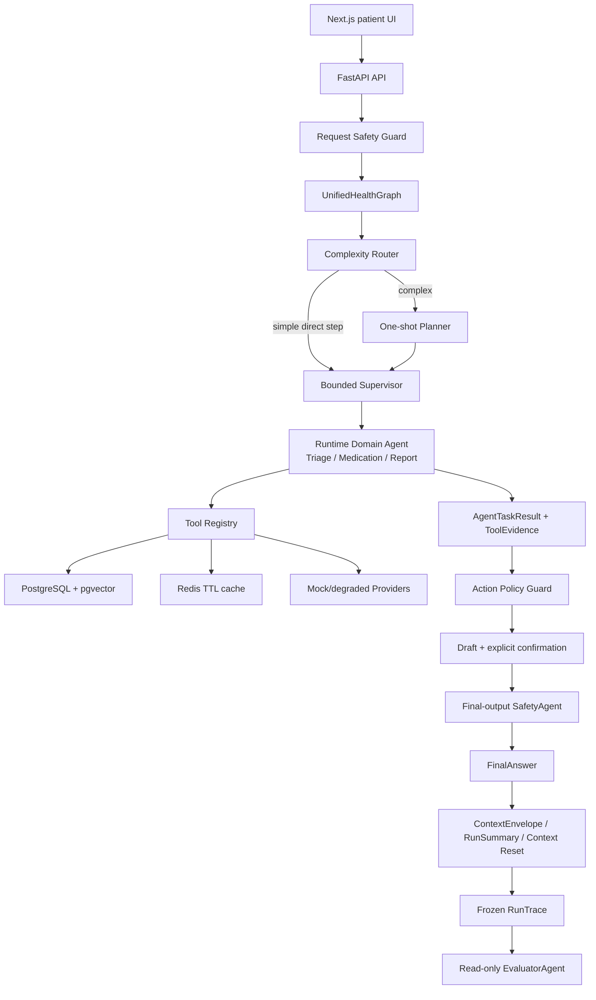

# 家庭健康服务 Multi-Agent

面向互联网医院慢病续方、用药提醒、预问诊和报告整理场景的工程化学习项目。项目重点不是堆叠 Agent 名词，而是实现一套可运行、可审计、可评测、可恢复的医疗业务辅助系统。

系统只做资料整理、流程辅助和确认前准备，不替代医生诊断、开方或调整用药。当前为本地开发与集成验收环境，未接入真实医院、药店、支付或通知系统，也不是生产医疗系统。

## 项目亮点

| 工程问题 | 当前实现 |
| --- | --- |
| 多 Agent 如何避免无限循环 | 统一入口使用 Router、一次性 Planner 和 bounded Supervisor；Planner 对明确表达的业务顺序生成有限 DAG，Supervisor 按依赖和最大步数执行；步骤级工具白名单在 runtime 强制校验，治理节点由固定图调用 |
| 医疗动作如何避免越权 | 请求入口、动作执行前、最终输出前三层安全检查；受保护动作必须经过显式确认和幂等校验 |
| 上下文如何避免跨成员污染 | `ContextEnvelope`、角色最小视图、Context Reset/Compaction；所有事实引用绑定 `member_id` 与来源 |
| 中断任务如何恢复 | PostgreSQL 保存权威 Task Checkpoint，Redis 只做带 TTL 的短期缓存，缓存故障时回源 PostgreSQL |
| RAG 如何保证可追溯 | PostgreSQL + pgvector、关键词降级、RRF 融合、版本校验和 `source_id` 引用 |
| 外部依赖失败怎么办 | Tool Registry 和 Provider Registry 统一 timeout、有限重试、错误分类、降级结果与 attempt trace |
| Agent 质量如何证明 | 300 个 WorldState、1200 条 Query 和九维 deterministic Runner；另用 32 条消融用例验证编排，用 8 条真实 LLM 样本验证人工审核、token、成本和延迟链路 |
| 没有模型 Key 能否运行 | 默认 deterministic Model Gateway；可选 OpenAI-compatible provider，未配置 Key 时前后端和测试仍可运行 |

## 系统架构



业务角色保持精简：

- `TriageAgent`：结构化症状和红旗信号，提供就医/科室候选，不诊断。
- `MedicationAgent`：整理处方、药箱、库存、续方材料和提醒草稿，不开方、不改剂量、不下单。
- `ReportAgent`：解析医疗文档并提供有来源的通俗解释，不给诊断或治疗方案。
- `SafetyAgent`：运行时安全拦截，属于治理层。
- `EvaluatorAgent`：答案生成后的只读评测，不能修改答案或业务状态。

> 重要边界：`/api/business-tasks` 的默认路径已经由 `SupervisorBusinessWorkflow` 让 Supervisor 实际调用运行时 `TriageAgent`、`MedicationAgent` 和 `ReportAgent`，并把 Tool/Provider/RAG 证据带回统一 Trace；`business_domain` 不再直接选择最终业务执行分支。`/api/agent-runs` 仍是前端兼容入口，不能和新业务任务链混为一谈。4D-B3 已冻结 8 条真实模型 development 样本的人工复核报告；其余 v2 数据仍未完成全量人工审核和真实映射，局部报告不是生产或临床指标。

## 当前状态

[开发总路线图](docs/DEVELOPMENT_ROADMAP.md) 是阶段编号、状态和实施顺序的唯一权威来源。

- `4B` 后端工程能力：完成。
- `4C` 患者端、黄金链路、浏览器 E2E 和固定演示：完成。
- `4D-A` 五组 gold benchmark 数据：已审核并冻结。
- `4D-B` 自动化评测与最终可复现指标：B5.1-B5.6 代码与回归已完成；B3 的 8 条真实模型 development 报告已完成，v2 的 300 个 WorldState/1200 条 Query 已按 `4d-b5.5` 分离 domain DAG 与治理图。全量人工审核、真实 PostgreSQL 映射和三 split 正式报告仍是独立验收门槛。

当前已构建 300 个 WorldState、1200 条 Query 的版本化评测集，并完成九维 deterministic preview 回放；数据按 development/validation/holdout 拆分，但仍待全量人工审核和真实映射，因此 preview 通过率不作为质量指标。B5 已完成 Planner 依赖、计划级工具权限、角色兼容层和 v2 domain/governance 评测口径收口。B3 已用 `deepseek-v4-flash` 完成 8 条 development 固定样本，并由人工对“FinalAnswer + 草稿/来源快照”逐条复核，结果为 `8/8` 通过；平均总 token `1032.5`、按本机价格配置计算的平均单次成本 `$0.00146525`、本机 workflow/model p95 为 `5239/4452 ms`。这些数字只属于两个已映射成员和提醒/购药场景，不是生产 SLO、临床安全率或开放问答准确率。详见 [4D-B2.6 集成状态](docs/4D_B2.6_INTEGRATION_STATUS.md)、[4D-B3 真实模型评测](docs/4D_B3_REAL_LLM.md) 和路线图的 `4D-B`。

### 当前用户端改版

用户端页面的阶段状态和唯一执行顺序以 [开发总路线图](docs/DEVELOPMENT_ROADMAP.md) 为准。当前 UX-01～UX-09 已完成：AI 健康助手支持自然语言咨询、用户可读结果、明确确认和“历史咨询”记录；报告解读支持报告列表、详情、指标解释、参考范围、趋势和来源提示；历史记录、家庭管理和报告均按当前家庭成员隔离；首页和导航只保留四个用户业务入口。UX-09 已完成真实前后端联调、响应式和可访问性收口。

本阶段 UX-04 的实现说明、修改文件、运行方式、测试结果和下一步边界见 [前端架构文档](docs/FRONTEND_ARCHITECTURE.md)；内部确认字段继续保留在代码和接口契约中，不作为用户端约束文案展示。

## Docker 启动

### 第一次启动

1. 在 Windows 开始菜单搜索并打开 **Docker Desktop**。
2. 等待 Docker Desktop 显示 **Engine running**。
3. 打开 PowerShell，执行：

```powershell
Set-Location E:\project_code\hospital
if (-not (Test-Path .env)) { Copy-Item .env.example .env }
docker compose config --quiet
docker compose up -d --build --wait --wait-timeout 300
docker compose ps
```

正常情况下，`postgres`、`redis`、`backend`、`frontend` 都会显示 `healthy`。然后打开：

- 患者端：<http://localhost:3000>
- Agent 黄金链路：<http://localhost:3000/agent>
- Swagger API：<http://localhost:8000/docs>
- 后端健康检查：<http://localhost:8000/health>

Agent 运行在 `backend` 容器内，不需要单独启动 Agent 容器。

### 以后启动与关闭

未修改代码、依赖或 Compose 配置时：

```powershell
Set-Location E:\project_code\hospital
docker compose start
docker compose ps
```

日常关闭并保留数据库：

```powershell
docker compose stop
```

代码、依赖或配置发生变化时：

```powershell
docker compose up -d --build --wait --wait-timeout 300
```

不要把 `docker compose down -v` 当作普通关闭命令，它会删除本地 PostgreSQL/Redis volume。完整的 Docker Desktop 点击步骤、首次启动、日常启动、日志和排错见 [本地环境与部署指南](docs/LOCAL_SETUP_AND_DEPLOYMENT.md)。

## 配置与密钥

本地配置从模板创建：

```powershell
Copy-Item .env.example .env
```

- `.env.example` 只保存可公开的变量名和本地默认值，可以提交。
- `.env`、`.env.local`、`.env.production` 等本机配置已被 Git 忽略。
- API Key、真实密码、Token 和患者数据不得写入代码、fixture、报告或 Git。
- 默认 `MODEL_PROVIDER=deterministic`，不需要模型 Key。
- 真实模型只允许通过服务端环境变量配置，详见 [LLM 配置](docs/LLM_CONFIGURATION.md)。

### GitHub 数据边界

- 可以提交：API 源代码、数据库 schema/migration、脱敏 seed、固定 seed 生成的合成测试 fixture、测试代码和设计文档。
- 禁止提交：`.env`、API Key、Token、真实密码、真实患者/成员数据、本机 identity/source map、人工审核队列、模型原始输出和本机 benchmark 报告。
- `backend/tests/fixtures/benchmarks/v2/` 中的 300 个 WorldState 和 1200 条 Query 全部使用合成 ID、药品编码和场景，不是患者数据；它们随仓库发布，用于复现评测契约。
- `output/`、`var/`、`*.local.json`、`*identity_map*.json` 和 `*review_queue*.json` 已由 Git 忽略。

## 本地验证

2026-08-01 发布前复验：

| 验证层 | 结果 | 真实性边界 |
| --- | ---: | --- |
| 后端 pytest | `356 passed` | 本地自动化，含 SQLite 隔离测试、统一图边界、B3 审核冻结和契约/异常分支 |
| 前端 Vitest | `25 passed` | 组件与 API client 测试 |
| TypeScript | `passed` | `tsc --noEmit` |
| Next.js build | `passed` | 本地生产构建 |
| 浏览器 E2E | `7 passed` | 本轮使用 Docker + Microsoft Edge 重新执行 |
| Docker 后端验收 | 最近一次 baseline `19/19`、Redis 故障 `18/18` | 本机集成证据，不是生产 SLO |
| v2 评测 Runner | `1200` 条 Query 完成九维 preview 回放 | 合成投影管线验证，不是模型准确率 |
| 真实 LLM 审核 | `8/8` 固定产物人工通过 | 两个映射成员、提醒/购药场景，不是开放问答质量 |

UX-06 增量验证（2026-08-03）：前端 `npm run test` 为 `34 passed`，`npm run typecheck` 和 `npm run build` 通过；后端 `backend/tests/test_read_api.py` 为 `6 passed`，后端全量回归为 `361 passed`。详情页只读消费 `report-detail.v1`，不新增数据库 schema，也不输出诊断或治疗结论。

运行后端测试：

```powershell
Set-Location E:\project_code\hospital
$env:PYTHONPATH=(Resolve-Path 'backend').Path
.\.venv\Scripts\python.exe -m pytest backend\tests -q -p no:cacheprovider --basetemp=output\pytest-all
```

运行前端验证：

```powershell
Set-Location E:\project_code\hospital\frontend
npm test
npm run typecheck
npm run build
```

完整 MVP 收口：

```powershell
Set-Location E:\project_code\hospital
.\scripts\closeout_4c.ps1
```

测试分层、Windows 临时目录权限处理和 review 方法见 [测试指南](docs/TESTING_GUIDE.md)。

运行 4D-B2.5 本地 preview（不会访问数据库、Provider、RAG 或 LLM）：

```powershell
Set-Location E:\project_code\hospital
$env:PYTHONPATH=(Resolve-Path 'backend').Path
.\.venv\Scripts\python.exe -B -m app.agent.v2_eval_runner `
  --project-root (Resolve-Path '.') `
  --max-cases 1200 `
  --allow-pending-review `
  --output-dir output\benchmarks\v2
```

输出为 `output/benchmarks/v2/agent_eval_report.v2.preview.json` 和 Markdown。因为 v2 数据仍是
`pending_review`，必须显式传 `--allow-pending-review`，且报告只标记为 `preview`，不能把其中的 100% 通过率写进简历。

运行 4D-B2.6 A/B/C/D preview：

```powershell
Set-Location E:\project_code\hospital
$env:PYTHONPATH=(Resolve-Path 'backend').Path
.\.venv\Scripts\python.exe scripts\run_4d_b26_ablation.py `
  --max-cases 16 `
  --split development `
  --output-dir output\benchmarks\4d-b26-ablation
```

第一条真实 PostgreSQL/RAG/Provider/UnifiedHealthGraph integration sample 的运行方式和本地
identity map 约束见 [4D-B2.6 集成状态](docs/4D_B2.6_INTEGRATION_STATUS.md)。

运行 4D-B3 离线检查（不调用模型）：

```powershell
Set-Location E:\project_code\hospital
$env:PYTHONPATH=(Resolve-Path 'backend').Path
.\.venv\Scripts\python.exe scripts\run_4d_b3_real_llm.py `
  --output-dir output\benchmarks\4d-b3-real-llm-check
```

真实模型必须显式加入 `--live`，完整配置和第一次只跑 1 条 case 的流程见 [4D-B3 真实模型评测](docs/4D_B3_REAL_LLM.md)。

## 项目结构

```text
hospital/
├─ backend/
│  ├─ app/
│  │  ├─ api/          # HTTP 入参、出参和依赖注入
│  │  ├─ schemas/      # Pydantic DTO
│  │  ├─ models/       # SQLAlchemy ORM
│  │  ├─ services/     # 业务逻辑
│  │  ├─ tools/        # Agent 工具与权限
│  │  ├─ providers/    # 外部系统适配与可靠性
│  │  ├─ agent/        # LangGraph、上下文、评测和 Harness
│  │  ├─ rag/          # 关键词、向量、RRF 和来源
│  │  ├─ safety/       # 医疗安全与确认规则
│  │  └─ core/         # 配置、数据库、日志和异常
│  ├─ alembic/         # 线性数据库迁移
│  └─ tests/           # 单元、集成、契约与固定 fixture
├─ frontend/           # Next.js 患者端与 Playwright E2E
├─ scripts/            # seed、验收、benchmark 和一键收口
├─ docs/               # 设计、接口、部署、评测和学习文档
├─ docker-compose.yml
└─ .env.example
```

## 核心文档

- [文档导航](docs/README.md)
- [唯一开发总路线图](docs/DEVELOPMENT_ROADMAP.md)
- [技术设计](docs/TECH_DESIGN.md)
- [API 规范](docs/API_SPEC.md)
- [Agent 架构](docs/AGENT_ARCHITECTURE.md)
- [上下文与记忆](docs/CONTEXT_MANAGEMENT.md)
- [RAG 检索](docs/RAG_RETRIEVAL.md)
- [安全策略](docs/SAFETY_POLICY.md)
- [测试指南](docs/TESTING_GUIDE.md)
- [4D-B2.6 集成状态与运行手册](docs/4D_B2.6_INTEGRATION_STATUS.md)
- [4D-B3 真实模型评测](docs/4D_B3_REAL_LLM.md)
- [核心代码走读](docs/learning/CORE_CODE_WALKTHROUGH.md)

## 仍未完成

- 完成人工审核并冻结 v2 WorldState/Query、完整 identity/source map 和三 split integration report。
- 完成真实 A/B/C/D 消融、badcase 复核和正式报告；当前 Docker `19/19` 回归与一条 integration sample 已通过，但仍属于本机证据。
- 扩展真实 OpenAI-compatible LLM 的 validation/holdout 与更多成员/业务样本；当前 8 条 development 样本已人工复核并冻结，但只代表两个本机已映射成员和两个业务场景。
- 将真实冻结 RunTrace、Checkpoint 恢复、Provider attempt 和重复 wall-clock 运行接入正式 benchmark report。
- 接入真实医院、药店、文档解析或通知 Provider，并完成 sandbox 契约验收。
- 建设生产认证、权限、秘密管理、HTTPS、监控告警、备份恢复、CI/CD 和合规流程。

这些是明确的工程缺口，不影响本地学习、deterministic 演示和自动化回归，但在完成前不能描述为生产系统或真实医疗服务。

## 医疗安全边界

- 不诊断、不开方、不修改医生处方。
- 不建议用户自行停药、加量、减量或换药。
- 复诊、购药和提醒执行等受保护动作必须显式确认。
- 无 DB、Provider 或 RAG 来源时，不编造病史、库存、处方或医疗规则。
- mock/degraded Provider、本机延迟和 deterministic fixture 指标不代表真实外部系统、临床正确率或生产性能。

## UX-08 验证结果

首页和导航只保留 AI 健康助手、历史咨询、家庭管理和报告解读；知识检索、库存、续方计划、提醒草稿和 Trace 详情仅保留为代码内部能力或兼容跳转。前端类型检查、35 个测试、生产构建和公共入口 E2E 均通过。

## UX-09 验证结果

UX-09 完成真实 Docker 前后端联调：成员切换、咨询确认续跑、历史记录隔离、家庭管理聚合数据、报告成员权限和旧入口跳转均通过；用户端统一隐藏后端内部答案、来源标识、运行 ID、草稿执行描述和英文内部标签。发现低库存续方的药店库存工具输入缺少药品名后，补充从已读取药箱/处方事实投影输入的契约修复，不改变数据库或外部动作。

验证结果：前端全量 Vitest `36 passed`、TypeScript 检查通过、Next.js 生产构建通过；真实 Playwright `9 passed`；后端新增工具输入契约单测 `1 passed`。在 1440×900 和 390×844 视口下公开页面无横向溢出，交互控件均有可访问名称。当前 Docker 联调使用 deterministic provider 以保证测试可复现；这不代表真实模型质量或生产医疗服务能力。
