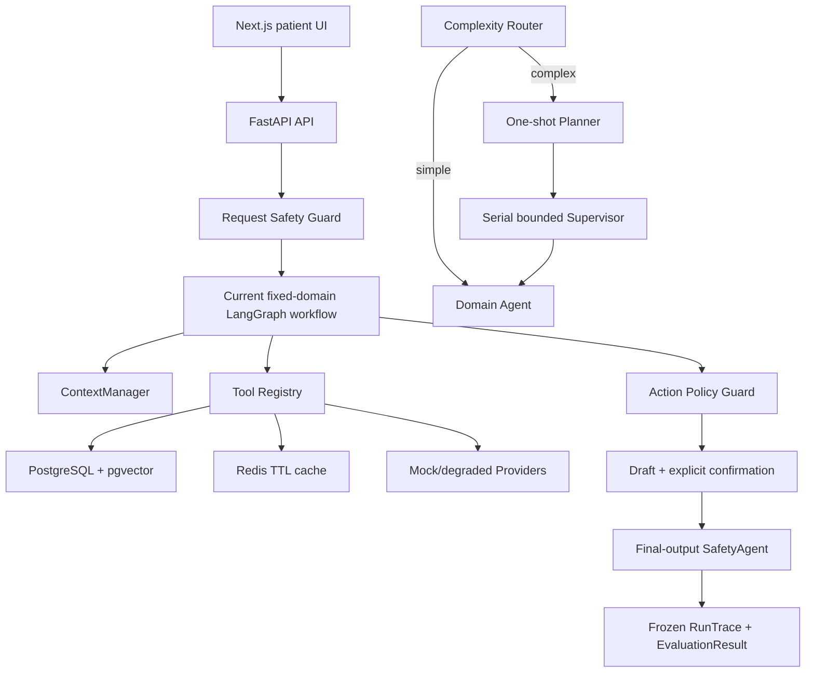

# 家庭健康服务 Multi-Agent

面向互联网医院慢病续方、用药提醒、预问诊和报告整理场景的工程化学习项目。项目重点不是堆叠 Agent 名词，而是实现一套可运行、可审计、可评测、可恢复的医疗业务辅助系统。

系统只做资料整理、流程辅助和确认前准备，不替代医生诊断、开方或调整用药。当前为本地开发与集成验收环境，未接入真实医院、药店、支付或通知系统，也不是生产医疗系统。

## 项目亮点

| 工程问题 | 当前实现 |
| --- | --- |
| 多 Agent 如何避免无限循环 | 简单任务直达领域 Agent；复杂任务由一次性 Planner 生成计划，再由串行 bounded Supervisor 按依赖和最大步数调度 |
| 医疗动作如何避免越权 | 请求入口、动作执行前、最终输出前三层安全检查；受保护动作必须经过显式确认和幂等校验 |
| 上下文如何避免跨成员污染 | `ContextEnvelope`、角色最小视图、Context Reset/Compaction；所有事实引用绑定 `member_id` 与来源 |
| 中断任务如何恢复 | PostgreSQL 保存权威 Task Checkpoint，Redis 只做带 TTL 的短期缓存，缓存故障时回源 PostgreSQL |
| RAG 如何保证可追溯 | PostgreSQL + pgvector、关键词降级、RRF 融合、版本校验和 `source_id` 引用 |
| 外部依赖失败怎么办 | Tool Registry 和 Provider Registry 统一 timeout、有限重试、错误分类、降级结果与 attempt trace |
| Agent 质量如何证明 | deterministic Evaluator、固定 gold 数据、32 条 A/B/C 消融 fixture、Docker/API/E2E 与本地观测 runner |
| 没有模型 Key 能否运行 | 默认 deterministic Model Gateway；可选 OpenAI-compatible provider，未配置 Key 时前后端和测试仍可运行 |

## 系统架构



业务角色保持精简：

- `TriageAgent`：结构化症状和红旗信号，提供就医/科室候选，不诊断。
- `MedicationAgent`：整理处方、药箱、库存、续方材料和提醒草稿，不开方、不改剂量、不下单。
- `ReportAgent`：解析医疗文档并提供有来源的通俗解释，不给诊断或治疗方案。
- `SafetyAgent`：运行时安全拦截，属于治理层。
- `EvaluatorAgent`：答案生成后的只读评测，不能修改答案或业务状态。

> 重要边界：Router、Planner、bounded Supervisor 编排内核已实现、测试并完成 A/B/C 消融，但当前两个 HTTP 业务入口仍使用固定领域工作流，尚未统一接入该内核。仓库没有把“内核已实现”包装成“线上 API 已动态调度”。

## 当前状态

[开发总路线图](docs/DEVELOPMENT_ROADMAP.md) 是阶段编号、状态和实施顺序的唯一权威来源。

- `4B` 后端工程能力：完成。
- `4C` 患者端、黄金链路、浏览器 E2E 和固定演示：完成。
- `4D-A` 五组 gold benchmark 数据：已审核并冻结。
- `4D-B` 自动化评测与最终可复现指标：进行中。

当前最重要的未完成项是：统一 HTTP 运行链与 bounded Supervisor、用 Docker PostgreSQL/pgvector 运行完整 4D 指标、验证 PostgreSQL Checkpoint/Redis 故障恢复、接入可选真实 LLM 后测量回答质量与 token/cost。完整清单见路线图的 `4D-B` 和本文“仍未完成”章节。

## Docker 启动

### 第一次启动

1. 在 Windows 开始菜单搜索并打开 **Docker Desktop**。
2. 等待 Docker Desktop 显示 **Engine running**。
3. 打开 PowerShell，执行：

```powershell
Set-Location E:\project_code\hospital
if (-not (Test-Path .env)) { Copy-Item .env.example .env }
docker compose config --quiet
docker compose up -d --build --wait --wait-timeout 300
docker compose ps
```

正常情况下，`postgres`、`redis`、`backend`、`frontend` 都会显示 `healthy`。然后打开：

- 患者端：<http://localhost:3000>
- Agent 黄金链路：<http://localhost:3000/agent>
- Swagger API：<http://localhost:8000/docs>
- 后端健康检查：<http://localhost:8000/health>

Agent 运行在 `backend` 容器内，不需要单独启动 Agent 容器。

### 以后启动与关闭

未修改代码、依赖或 Compose 配置时：

```powershell
Set-Location E:\project_code\hospital
docker compose start
docker compose ps
```

日常关闭并保留数据库：

```powershell
docker compose stop
```

代码、依赖或配置发生变化时：

```powershell
docker compose up -d --build --wait --wait-timeout 300
```

不要把 `docker compose down -v` 当作普通关闭命令，它会删除本地 PostgreSQL/Redis volume。完整的 Docker Desktop 点击步骤、首次启动、日常启动、日志和排错见 [本地环境与部署指南](docs/LOCAL_SETUP_AND_DEPLOYMENT.md)。

## 配置与密钥

本地配置从模板创建：

```powershell
Copy-Item .env.example .env
```

- `.env.example` 只保存可公开的变量名和本地默认值，可以提交。
- `.env`、`.env.local`、`.env.production` 等本机配置已被 Git 忽略。
- API Key、真实密码、Token 和患者数据不得写入代码、fixture、报告或 Git。
- 默认 `MODEL_PROVIDER=deterministic`，不需要模型 Key。
- 真实模型只允许通过服务端环境变量配置，详见 [LLM 配置](docs/LLM_CONFIGURATION.md)。

## 本地验证

2026-07-31 发布前复验：

| 验证层 | 结果 | 真实性边界 |
| --- | ---: | --- |
| 后端 pytest | `308 passed` | 本地自动化，含 SQLite 隔离测试和契约/异常分支 |
| 前端 Vitest | `25 passed` | 组件与 API client 测试 |
| TypeScript | `passed` | `tsc --noEmit` |
| Next.js build | `passed` | 本地生产构建 |
| 浏览器 E2E | 最近一次 `7 passed` | Docker + Microsoft Edge，本轮未因 Docker Desktop 未启动而重跑 |
| Docker 后端验收 | 最近一次 baseline `19/19`、Redis 故障 `18/18` | 本机集成证据，不是生产 SLO |

运行后端测试：

```powershell
Set-Location E:\project_code\hospital
$env:PYTHONPATH=(Resolve-Path 'backend').Path
.\.venv\Scripts\python.exe -m pytest backend\tests -q -p no:cacheprovider --basetemp=output\pytest-all
```

运行前端验证：

```powershell
Set-Location E:\project_code\hospital\frontend
npm test
npm run typecheck
npm run build
```

完整 MVP 收口：

```powershell
Set-Location E:\project_code\hospital
.\scripts\closeout_4c.ps1
```

测试分层、Windows 临时目录权限处理和 review 方法见 [测试指南](docs/TESTING_GUIDE.md)。

## 项目结构

```text
hospital/
├─ backend/
│  ├─ app/
│  │  ├─ api/          # HTTP 入参、出参和依赖注入
│  │  ├─ schemas/      # Pydantic DTO
│  │  ├─ models/       # SQLAlchemy ORM
│  │  ├─ services/     # 业务逻辑
│  │  ├─ tools/        # Agent 工具与权限
│  │  ├─ providers/    # 外部系统适配与可靠性
│  │  ├─ agent/        # LangGraph、上下文、评测和 Harness
│  │  ├─ rag/          # 关键词、向量、RRF 和来源
│  │  ├─ safety/       # 医疗安全与确认规则
│  │  └─ core/         # 配置、数据库、日志和异常
│  ├─ alembic/         # 线性数据库迁移
│  └─ tests/           # 单元、集成、契约与固定 fixture
├─ frontend/           # Next.js 患者端与 Playwright E2E
├─ scripts/            # seed、验收、benchmark 和一键收口
├─ docs/               # 设计、接口、部署、评测和学习文档
├─ docker-compose.yml
└─ .env.example
```

## 核心文档

- [文档导航](docs/README.md)
- [唯一开发总路线图](docs/DEVELOPMENT_ROADMAP.md)
- [技术设计](docs/TECH_DESIGN.md)
- [API 规范](docs/API_SPEC.md)
- [Agent 架构](docs/AGENT_ARCHITECTURE.md)
- [上下文与记忆](docs/CONTEXT_MANAGEMENT.md)
- [RAG 检索](docs/RAG_RETRIEVAL.md)
- [安全策略](docs/SAFETY_POLICY.md)
- [测试指南](docs/TESTING_GUIDE.md)
- [核心代码走读](docs/learning/17_CORE_CODE_WALKTHROUGH.md)

## 仍未完成

- 将 bounded Supervisor 内核统一接入当前 HTTP 业务运行链，删除或迁移两套兼容运行入口。
- 配置并验证真实 OpenAI-compatible LLM；未提供 Key 时，回答质量、token 和成本指标保持 `N/A`。
- 用 Docker PostgreSQL + pgvector 跑完 4D RAG gold，而不是只依赖本地关键词/SQLite 观测。
- 将真实冻结 RunTrace、Checkpoint 恢复、Provider attempt 和重复 wall-clock 运行接入统一 benchmark report。
- 接入真实医院、药店、文档解析或通知 Provider，并完成 sandbox 契约验收。
- 建设生产认证、权限、秘密管理、HTTPS、监控告警、备份恢复、CI/CD 和合规流程。

这些是明确的工程缺口，不影响本地学习、deterministic 演示和自动化回归，但在完成前不能描述为生产系统或真实医疗服务。

## 医疗安全边界

- 不诊断、不开方、不修改医生处方。
- 不建议用户自行停药、加量、减量或换药。
- 复诊、购药和提醒执行等受保护动作必须显式确认。
- 无 DB、Provider 或 RAG 来源时，不编造病史、库存、处方或医疗规则。
- mock/degraded Provider、本机延迟和 deterministic fixture 指标不代表真实外部系统、临床正确率或生产性能。
