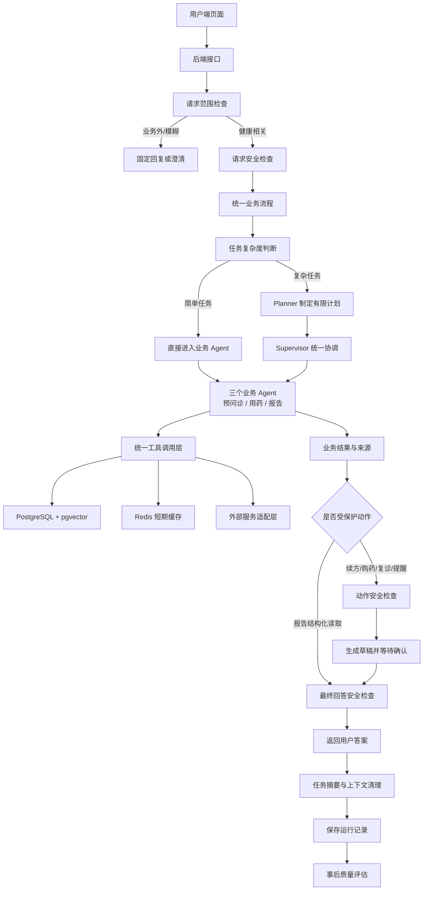
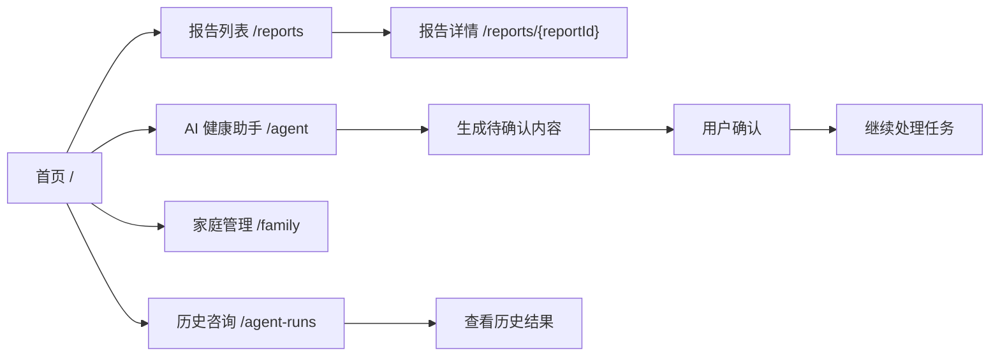
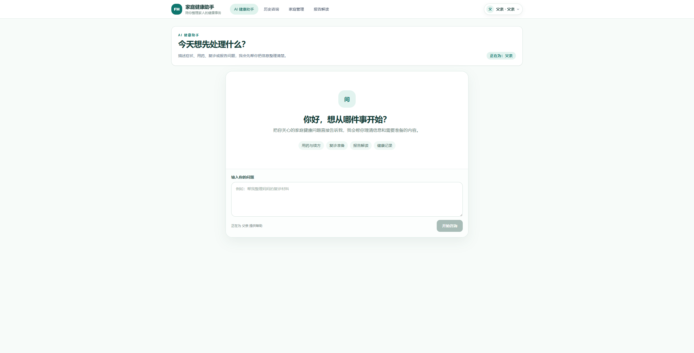
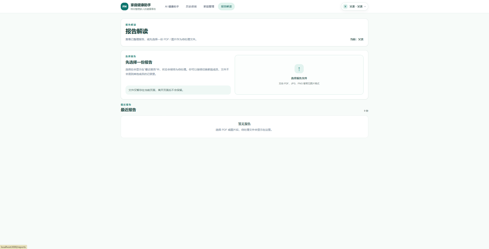

# 家庭健康服务智能助手

这是一个面向互联网医院家庭用户的智能健康服务项目，主要处理慢病续方准备、用药提醒、预问诊信息整理和检查报告解读。

项目从需求分析、后端接口、数据设计、Agent 编排、RAG 检索到前端页面都由代码实现，适合作为后端和大模型应用开发项目阅读。

系统只做资料整理、流程辅助和确认前准备，不替代医生诊断、开方或调整用药。项目以本地环境作为演示和学习环境，未接入真实医院、药店、支付或通知系统。

## 解决的问题与实现

| 工程问题 | 项目中的做法 |
| --- | --- |
| 多 Agent 如何协作 | 先判断简单还是复杂任务；复杂任务由 Planner 制定有限计划，再由 Supervisor 协调三个业务 Agent，过程有明确的结束条件 |
| 医疗动作如何避免越权 | 请求、动作和最终回答都会经过安全检查；续方、购药和提醒等动作必须经过用户确认 |
| 业务外输入如何避免浪费链路 | 在医疗安全前用确定性 Scope Guard 拦截高置信度天气、编程、股票等请求；不调用 Router、RAG、工具或模型 |
| 如何避免家庭成员信息混在一起 | 每次任务只围绕一个家庭成员建立上下文，查询结果和来源都带成员范围 |
| 检查报告怎样快速变成可读信息 | 文本和 Markdown 表格直接解析；PDF 用 `pypdf` 读取文本层；图片在本地通过 RapidOCR + ONNX Runtime CPU 识别，再统一输出章节、表格、指标与来源 |
| 中断任务如何继续 | PostgreSQL 保存可以恢复的任务记录，Redis 只保存短期缓存，缓存失效时重新从 PostgreSQL 读取 |
| RAG 如何保证有依据 | 在活动知识版本内执行 BM25 与 pgvector HNSW 双路召回，RRF 融合后按实体过滤、轻量重排并保留来源编号 |
| 外部服务失败怎么办 | 统一处理超时、有限重试、错误分类和降级，不把失败伪装成成功 |
| 如何判断 Agent 做得对不对 | 保存运行记录，用固定场景检查任务完成、工具调用、来源、安全和成员隔离 |
| 不配置模型密钥能否运行 | 默认使用本地确定性模式；配置模型服务后可以切换到真实模型 |

## 项目简介

该仓库是一个互联网医院家庭健康服务项目，主要解决家庭成员的处方、药箱、检查报告和用药提醒信息分散的问题。系统面向慢病续方准备、预问诊信息整理、用药提醒和报告解读等场景，重点不是让模型自由聊天，而是把一次任务安全地执行完。用户提出问题后，系统先确认当前要处理的家庭成员和任务类型；简单任务直接进入对应的业务 Agent，复杂任务先由 Planner 制定有限计划，再由 Supervisor 协调预问诊、用药和报告三个 Agent，通过统一工具查询业务数据和知识库。系统会保留来源，避免成员信息串用；涉及续方、购药或提醒时只生成待确认内容，必须经过用户确认才能继续。整个项目包含后端接口、数据库、RAG、Agent 流程、前端页面和 Docker 启动环境，重点体现的是如何把大模型能力放进一个有边界、可追踪、可恢复的业务系统中。

## 系统架构



三个业务 Agent 的分工：

- 预问诊 Agent：整理症状和危险信号，提供就医或科室候选，不做诊断。
- 用药 Agent：整理处方、药箱、库存、续方材料和提醒草稿，不开方、不改剂量、不下单。
- 报告 Agent：整理报告内容和指标，给出有来源的通俗解释，不给诊断或治疗方案；报告上传后直接保存为可读结构，不生成确认草稿。
- Agent 安全：运行过程中拦截高风险请求和越权动作。
- Agent 评估：回答生成后检查这次任务是否完成，不修改答案和业务状态。

> 核心流程：简单任务直接进入对应 Agent；复杂任务由 Planner 制定有限计划，Supervisor 按计划协调三个业务 Agent。Agent 只能通过统一工具读取资料，结果必须带来源；涉及续方、购药或提醒时，系统先生成待确认内容，用户确认后才能继续。安全检查和事后评估由系统固定执行。

## 前端关键页面

前端使用 Next.js/React，配合 TypeScript 和 Tailwind CSS 完成页面。页面负责展示信息、切换家庭成员和发起咨询，不在浏览器中做医疗判断，也不直接访问数据库。



| 页面 | 入口 | 展示的关键业务 | 工程重点 |
| --- | --- | --- | --- |
| 首页 | [`/`](frontend/app/page.tsx) | 当前成员和四个主要服务入口 | 统一导航和成员选择 |
| AI 健康助手 | [`/agent`](frontend/app/agent/page.tsx) | 自然语言咨询、续方、提醒、复诊准备和确认 | 先整理，再由用户确认继续 |
| 报告列表 | [`/reports`](frontend/app/reports/page.tsx) | 报告选择和最近报告 | 按成员显示，上传后直接进入可读历史 |
| 报告详情 | [`/reports/[reportId]`](frontend/app/reports/%5BreportId%5D/page.tsx) | 报告摘要、指标、趋势、内容和来源 | 文本、表格、PDF 文本层和图片 OCR 统一读取；只做解释，不输出诊断结论 |
| 家庭管理 | [`/family`](frontend/app/family/page.tsx) | 健康档案、药箱、处方和购药记录 | 切换成员后重新加载对应资料 |
| 历史咨询 | [`/agent-runs`](frontend/app/agent-runs/page.tsx) | 过去的咨询状态和整理结果 | 只显示当前成员的历史 |

### 页面预览

以下截图来自本项目患者端，使用的是合成成员数据。把下面两个图片文件和 README 一起提交到 GitHub 后，仓库首页会直接显示：

<p>
  
  
</p>

启动 Docker 后可直接访问：

- 患者端首页：<http://localhost:3000>
- AI 健康助手：<http://localhost:3000/agent>
- 报告解读：<http://localhost:3000/reports>
- 家庭管理：<http://localhost:3000/family>
- 历史咨询：<http://localhost:3000/agent-runs>

前端页面设计、API 映射、成员隔离和浏览器 E2E 见 [前端架构文档](docs/FRONTEND_ARCHITECTURE.md)。

## 快速启动

### 第一次启动

1. 在 Windows 开始菜单搜索并打开 **Docker Desktop**。
2. 等待 Docker Desktop 显示 **Engine running**。
3. 打开 PowerShell，执行：

```powershell
Set-Location E:\project_code\hospital
if (-not (Test-Path .env)) { Copy-Item .env.example .env }
docker compose config --quiet
docker compose up -d --build --wait --wait-timeout 300
docker compose ps
```

正常情况下，`postgres`、`redis`、`backend`、`frontend` 都会显示 `healthy`。然后打开：

- 患者端：<http://localhost:3000>
- Agent 黄金链路：<http://localhost:3000/agent>
- Swagger API：<http://localhost:8000/docs>
- 后端健康检查：<http://localhost:8000/health>

Agent 运行在 `backend` 容器内，不需要单独启动 Agent 容器。

### 以后启动与关闭

未修改代码、依赖或 Compose 配置时：

```powershell
Set-Location E:\project_code\hospital
docker compose start
docker compose ps
```

日常关闭并保留数据库：

```powershell
docker compose stop
```

代码、依赖或配置发生变化时：

```powershell
docker compose up -d --build --wait --wait-timeout 300
```

不要把 `docker compose down -v` 当作普通关闭命令，它会删除本地 PostgreSQL/Redis volume。完整的 Docker Desktop 点击步骤、首次启动、日常启动、日志和排错见 [本地环境与部署指南](docs/LOCAL_SETUP_AND_DEPLOYMENT.md)。

## 配置与密钥

本地配置从模板创建：

```powershell
Copy-Item .env.example .env
```

- `.env.example` 只保存可公开的变量名和本地默认值，可以提交。
- `.env`、`.env.local`、`.env.production` 等本机配置已被 Git 忽略。
- 接口密钥、真实密码、访问令牌和患者数据不得写入代码、测试数据、报告或 Git。
- 默认 `MODEL_PROVIDER=deterministic`，不需要模型密钥。
- 业务回答模型使用 `MODEL_*`，RAGAS 独立 Judge 使用 `RAGAS_JUDGE_*`；两组 Base URL、Key 和模型名可分别配置。详见 [LLM 配置](docs/LLM_CONFIGURATION.md)。

### 报告解析能力

- 文本和 Markdown 表格：直接解析，连续表格按表头切分。
- PDF：使用 `pypdf` 读取可选择的文本层。
- 图片：使用本地 RapidOCR + ONNX Runtime CPU 识别，不发送图片到外部服务。
- 扫描版 PDF 暂不做 OCR；手写、模糊图片和复杂表格仅提供结构化整理，不能当作诊断结果。

### 上传边界

- 可以提交：源码、数据库迁移、脱敏 seed、合成测试数据和必要的设计文档。
- 不要提交：`.env`、接口密钥、真实密码、真实患者或成员数据，以及本机运行产生的临时报告。
- `output/`、`var/`、`*.local.json` 和本机映射文件已由 Git 忽略。

## 主要文档

README 只保留项目展示和快速启动信息，详细设计和学习材料见：

- [本地环境与 Docker 启动](docs/LOCAL_SETUP_AND_DEPLOYMENT.md)：第一次启动、日常启动、关闭和排错。
- [技术设计](docs/TECH_DESIGN.md)：系统分层、状态、确认和关键取舍。
- [Agent 架构](docs/AGENT_ARCHITECTURE.md)：Router、Planner、Supervisor、领域 Agent 和治理节点。
- [API 规范](docs/API_SPEC.md)：后端接口、请求响应和确认续跑。
- [RAG 检索](docs/RAG_RETRIEVAL.md)：BM25、Embedding、pgvector HNSW、RRF、实体过滤、轻量重排和来源引用。
- [Agent 统一评测数据集与报告](docs/RAG_SYNTHETIC_EVALUATION_DATASET.md)：Agent、工具参数、RAG、回答、安全、性能与成本的唯一数据和指标口径；当前 Agent 活动视图为 fast-400（100 个 WorldState、400 条 Query，240/80/80），完整 1,200 条仅作历史留档；RAG 当前来源绑定回答正确率 99.69%，260 条可回答题 RAGAS 为 0.9837/0.6818/1.0000，60 条无答案题独立验收，不混入生成式均值。所有数据自动生成与评分，不设人工复核门。
- [RAG 合成数据集构建方案](docs/RAG_SYNTHETIC_EVALUATION_DATASET_PLAN.md)：125/500 数据集 A–G 构建任务和冻结交付状态。
- [RAG 四指标优化实施明细](docs/RAG_SYNTHETIC_MINIMAL_OPTIMIZATION_IMPLEMENTATION.md)：M2–M5 的历史实现细节和回溯入口，数值以统一报告为准。
- [RAGAS 离线适配器与三视图 Harness](docs/implementation/RAGAS_OFFLINE_ADAPTER.md)：可选语义交叉验证、失败不阻断和 125/500 冻结数据集的三视图投影。
- [Triage 多轮澄清与安全续跑](docs/implementation/TRIAGE_CLARIFICATION_CONTINUATION.md)：缺槽位停止、PostgreSQL 权威 Checkpoint、新 run 续跑与成员隔离。
- [5A 业务闭环收口](docs/implementation/5A_CLOSEOUT.md)：报告统一解析、直接结构化读取、质量门和可复现验证。
- [简历与面试口径](docs/RESUME_NOTES.md)：业务背景、多 Agent Pipeline、简历一句话和最新实测指标。
- [核心代码走读](docs/learning/CORE_CODE_WALKTHROUGH.md)：从 API 到 Agent、Tool、RAG 和评测的代码学习路线。

## 项目结构

```text
hospital/
├─ backend/
│  ├─ app/
│  │  ├─ api/          # HTTP 入参、出参和依赖注入
│  │  ├─ schemas/      # 请求和响应的数据格式
│  │  ├─ models/       # 数据库表映射
│  │  ├─ services/     # 业务逻辑
│  │  ├─ tools/        # Agent 工具与权限
│  │  ├─ providers/    # 外部系统适配与可靠性
│  │  ├─ agent/        # 流程、上下文、评测和 Harness
│  │  ├─ rag/          # 关键词、向量检索和来源
│  │  ├─ safety/       # 医疗安全与确认规则
│  │  └─ core/         # 配置、数据库、日志和异常
│  ├─ alembic/         # 数据库迁移
│  └─ tests/           # 单元、集成、契约与固定测试场景
├─ frontend/           # 患者端页面与浏览器测试
├─ scripts/            # 初始化、验收和演示脚本
├─ docs/               # 设计、接口、部署和学习文档
├─ frontend-agent.png  # README 前端页面预览
├─ frontend-reports.png
├─ docker-compose.yml
└─ .env.example
```

## 项目边界

- 项目用于本地开发与集成验收，不直接用于生产医疗服务。
- 尚未接入真实医院、药店、支付、通知和生产认证系统；外部动作只保留本地草稿与状态契约。
- 不保存长期完整聊天，也不建立个人健康向量记忆；处方、报告和药箱事实始终从业务数据或 Provider 重新读取。

## 医疗安全边界

- 不诊断、不开方、不修改医生处方。
- 不建议用户自行停药、加量、减量或换药。
- 复诊、购药和提醒执行等受保护动作必须显式确认。
- 没有业务数据或知识来源时，不编造病史、库存、处方或医疗规则。
- 报告上传后直接返回来源可追溯的结构化指标，不诊断、不处方、不生成健康记录草稿；处方及有外部副作用的动作仍须显式确认。
- 最终回答在冻结前经过质量门；安全失败或无来源事实直接阻断，格式问题最多进行一次无工具修复。
