# 家庭健康服务 Multi-Agent

面向互联网医院家庭健康场景的本地可运行项目，覆盖慢病续方与提醒、预问诊/导诊、医疗报告整理和高风险医疗请求拦截。系统只做资料整理、流程辅助和确认前准备，不替代医生诊断、开方或调整用药。

项目仍处于开发与本地验收阶段，未接入真实医院、药店、支付或通知系统，也未上线生产环境。

## 当前进度

[开发总路线图](docs/DEVELOPMENT_ROADMAP.md) 是阶段、状态和顺序的唯一权威来源。`4B` 后端已完成，当前进入 `4C`：

- 任务 1：Git 线性历史，`DONE`。
- 任务 2：Alembic 迁移链与向量维度冲突，`DONE`。
- 任务 3：FastEmbed + PostgreSQL pgvector + 关键词降级，`DONE`。
- 任务 4：新业务 Model Gateway 双模式接线，`DONE`。
- 任务 5：最终契约与复杂度路由，`DONE`。
- 任务 6：三领域 Agent 与 bounded Supervisor，`DONE`。
- 任务 7：三层安全与确认状态机，`DONE`。
- 任务 8：分层状态与两次 run 续跑，`DONE`。
- 任务 9：Tool 与三类 Provider 可靠性，`DONE`。
- 任务 10：RAG、成员隔离与可观测性补强，`DONE`。
- 任务 11：32 条 Harness 与消融实验，`DONE`。
- 任务 12：PostgreSQL/Redis/Docker 后端验收，`DONE`；baseline 19/19、Redis 故障回源 18/18。
- 任务 13：4B 文档与 Git 收口，`DONE`。
- 当前阶段：`4C IN_PROGRESS`，患者端信息架构与 `/agent` 黄金链路 UI 已完成；当前进入浏览器 E2E 和最终演示收口。

当前代码仍保留旧 Agent Runtime 和旧确认草稿 API 的兼容流程；新业务任务链路已经使用任务七的三层 Safety Guard、自动本地 `DRAFT` 和 `DRAFT -> CONFIRMED -> EXECUTED` 状态机。任务八已将 PostgreSQL Task Checkpoint 设为权威源，Redis 仅做带 TTL 的短期投影并在 miss/过期/不可用时回源；任务十一已完成 32 条 deterministic Harness 和 A/B/C 同条件消融，任务十二已在本机 Docker 栈完成真实迁移、RAG、API、Redis 故障回源和并发确认验收，任务十三已完成 4B 文档与 Git 收口。

## 已实现基线

- FastAPI、Pydantic、SQLAlchemy、Alembic 和 PostgreSQL 分层后端。
- 家庭成员、健康档案、药箱、处方、购药记录、库存、知识检索和 Agent 审计 API。
- Tool Registry、成员隔离、结构化 Context/RunTrace、Context Reset/Compaction 和 deterministic Evaluator。
- LangGraph 有界工作流、运行时 Agent 安全、人工确认兼容流程与冻结运行产物。
- FastEmbed + pgvector 向量检索、关键词降级、索引版本校验和 `SourceRef` 溯源。
- deterministic / OpenAI-compatible Model Gateway；无 Key 时仍可本地运行。
- 任务六确定性编排内核：简单任务直达领域 Agent，复杂任务一次性规划并由 bounded Supervisor 串行执行；无 LLM/数据库/业务工具副作用。
- 任务七安全确认治理：Request/Action/Final Output 三层门禁、自动本地 `DRAFT`、作用域/版本/幂等校验和确认续跑；外部状态始终为 `not_submitted`。
- 任务八分层状态：Alembic `0007_task_checkpoint_state` 持久化 Task Checkpoint、确认记录和已确认偏好；同一 task 使用两个独立 run，Redis 缓存失效时回源 PostgreSQL，确认版本采用乐观并发校验。
- 任务九 Tool/Provider 可靠性：统一 validation/permission/not-found/timeout/rate-limit/provider-unavailable/business-conflict/schema/internal 分类；只读可恢复错误有限重试，写工具和不可恢复错误不重试；三类重点 Provider 保留 attempt、成员和来源审计。
- 任务十 RAG/隔离/可观测性：hybrid 检索使用 RRF 融合 rank 并保留两路原始分、版本和 fallback；过期向量来源被拒绝；成员资源 SQL、Tool 身份和 Redis 缓存均做作用域校验；冻结 Observation 只保留排障白名单字段。
- 任务十一 deterministic Harness：32 条业务 fixture 按八类覆盖，A/B/C 共生成 96 份冻结 `RunTrace`；统一聚合工具 exact-match、路由顺序、重复调用、Safety、隔离、RAG Recall@3/@5、引用和 fixture latency。
- 任务十二真实本机验收：Docker PostgreSQL/Redis/FastAPI/Next.js 健康，Alembic `0007`、幂等 seed、512 维 pgvector 索引、三条业务 API、Redis 故障 PostgreSQL 回源和并发确认通过；结果见 [任务十二后端验收报告](docs/task12_backend_acceptance_report.4b.md)。
- mock/degraded Provider Adapter、三条新业务任务 API 和 Next.js 演示页面。
- Docker Compose 本地 PostgreSQL、Redis、FastAPI、Next.js 演示链路。

历史 16 条契约基线见 [Agent 评测报告](docs/AGENT_EVAL_REPORT.md)，4B 的 32 条同条件 A/B/C 结果见 [任务十一消融报告](docs/agent_ablation_report.4b.md)。两者都是 deterministic 固定轨迹指标，不是临床效果、真实模型准确率或线上延迟。

## 最终 4B 架构

```mermaid
flowchart LR
    A["FastAPI request"] --> G1["Request Safety Guard"]
    G1 --> R["Complexity Router"]
    R -->|simple| D["One domain Agent"]
    R -->|complex| P["One-shot TaskPlanner"]
    P --> S["Serial bounded Supervisor"]
    S --> D
    D --> T["Tool Registry / Providers / RAG"]
    T --> G2["Action Policy Guard"]
    G2 --> F["Draft and FinalAnswer"]
    F --> G3["Final-output SafetyAgent"]
    G3 --> Z["Freeze artifacts and deterministic evaluation"]
```



最终业务 Agent 只有三个：

- `TriageAgent`：症状结构化、红旗信号和就医/科室候选，不诊断。
- `MedicationAgent`：处方、药箱、库存、续方材料和提醒草稿，不开方、不改剂量、不下单。
- `ReportAgent`：医疗文档解析、指标结构化和有来源解释，不给诊断或治疗方案。

简单请求直接进入一个领域 Agent；复杂跨领域请求才使用一次性 Planner 和串行 bounded Supervisor。SafetyAgent 与 EvaluatorAgent 属于治理层，由状态图固定调用，不是 Supervisor 可选择的业务角色。

状态采用最终分层方案：LangGraph Working State 只服务单次 run；PostgreSQL 权威保存 Task Checkpoint、确认记录和用户偏好；Redis 只做带 TTL 的短期缓存与多实例协调，故障时回源 PostgreSQL；医疗知识使用独立 PostgreSQL + pgvector。系统不保存长期完整聊天，也不建立个人健康向量记忆。

## 快速运行

推荐使用 Docker Compose 一键启动 PostgreSQL、Redis、FastAPI backend 和 Next.js frontend。详细安装、WSL 2、Docker 数据目录和故障排查见 [本地环境与部署](docs/LOCAL_SETUP_AND_DEPLOYMENT.md)。PowerShell 从仓库根目录执行：

```powershell
Set-Location E:\project_code\hospital
if (-not (Test-Path .env)) { Copy-Item .env.example .env }
docker compose up -d --build --wait --wait-timeout 300
docker compose ps
```

打开：

- 患者端：`http://localhost:3000`
- Agent 黄金链路：`http://localhost:3000/agent`
- Swagger：`http://localhost:8000/docs`
- 后端健康检查：`http://localhost:8000/health`

Agent 运行在 `backend` 容器内，不存在单独的 `agent` 容器；前端 `/agent` 发起请求后，由 FastAPI backend 执行 Agent 工作流。

查看日志：

```powershell
docker compose logs -f backend
docker compose logs -f frontend
```

只结束后端但保留数据库、Redis 和前端：

```powershell
docker compose stop backend
```

结束全部容器但保留数据：

```powershell
docker compose stop
```

默认 `MODEL_PROVIDER=deterministic`，不需要 API Key。真实模型和向量 RAG 配置见 [LLM 配置](docs/LLM_CONFIGURATION.md) 与 [RAG 设计](docs/RAG_RETRIEVAL.md)。

## 测试

```powershell
$env:PYTHONPATH=(Resolve-Path 'backend').Path
$env:PYTHONPYCACHEPREFIX=(Resolve-Path 'output').Path + '\pycache-all'
New-Item -ItemType Directory -Force output | Out-Null
python -m pytest backend\tests -q -p no:cacheprovider --basetemp=output\pytest-all
python -m compileall backend\app backend\tests

Set-Location frontend
npm test
npm run typecheck
npm run build
```

Windows 默认临时目录或旧 `__pycache__` 出现 `PermissionError` 时，使用 `output` 下新的 `--basetemp` 和 `PYTHONPYCACHEPREFIX`，不要复用无权限目录。完整分层测试和 review 清单见 [测试指南](docs/TESTING_GUIDE.md)。

任务六编排层也可以单独回归：

```powershell
$env:PYTHONPATH=(Resolve-Path 'backend').Path
python -m pytest backend\tests\test_domain_orchestration.py backend\tests\test_orchestration_contracts.py backend\tests\test_complexity_router.py -q -p no:cacheprovider --basetemp=var\pytest\4b-task6
```

任务七安全和确认状态机可以单独回归：

```powershell
$env:PYTHONPATH=(Resolve-Path 'backend').Path
python -m pytest backend\tests\test_safety_confirmation.py backend\tests\test_business_task_api.py -q -p no:cacheprovider --basetemp=var\pytest\4b-task7
```

任务八分层状态和确认版本可以单独回归：

```powershell
$env:PYTHONPATH=(Resolve-Path 'backend').Path
python -m pytest backend\tests\test_business_task_api.py backend\tests\test_task_checkpoint_cache.py -q -p no:cacheprovider --basetemp=var\pytest\4b-task8
```

任务九 Tool 与 Provider 可靠性可以单独回归：

```powershell
$env:PYTHONPATH=(Resolve-Path 'backend').Path
python -m pytest backend\tests\test_provider_adapters.py backend\tests\test_provider_reliability.py backend\tests\test_tool_registry.py backend\tests\test_business_task_api.py -q -p no:cacheprovider --basetemp=output\pytest-task9
```

任务十 RAG、隔离和 Observation 可以单独回归：

```powershell
$env:PYTHONPATH=(Resolve-Path 'backend').Path
$env:PYTHONPYCACHEPREFIX=(Resolve-Path 'output').Path + '\pycache-task10'
python -m pytest backend\tests\test_agent_contract_schemas.py backend\tests\test_hybrid_rag.py backend\tests\test_vector_rag.py backend\tests\test_db_backed_tools.py backend\tests\test_task_checkpoint_cache.py backend\tests\test_model_gateway.py backend\tests\test_task10_observability.py backend\tests\test_business_task_api.py backend\tests\test_runtime_e2e_harness.py -q --basetemp output\pytest-task10
```

任务十一 32 条 Harness 与消融报告：

```powershell
$env:PYTHONPATH=(Resolve-Path 'backend').Path
python -m app.agent.ablation_harness
python -m pytest backend\tests\test_ablation_harness.py -q -p no:cacheprovider --basetemp output\pytest-task11
```

任务十二真实后端验收：

```powershell
$env:RAG_VECTOR_ENABLED='true'
$env:RAG_EMBEDDING_PROVIDER='deterministic'
$env:RAG_EMBEDDING_MODEL='deterministic-hash-v1'
$env:RAG_EMBEDDING_DIMENSIONS='512'
docker compose up -d --build --wait --wait-timeout 300
.\.venv\Scripts\python.exe scripts\task12_acceptance.py --require-vector
```

这组命令使用临时 PowerShell 环境变量，不修改 `.env`。Redis 故障回源检查见 [本地环境与部署](docs/LOCAL_SETUP_AND_DEPLOYMENT.md) 和验收报告；它只验证本机开发环境，不代表生产可用性或临床指标。

## 文档入口

- [文档导航](docs/README.md)
- [唯一开发总路线图](docs/DEVELOPMENT_ROADMAP.md)
- [技术设计](docs/TECH_DESIGN.md)
- [Agent 架构](docs/AGENT_ARCHITECTURE.md)
- [业务流程](docs/BUSINESS_WORKFLOWS.md)
- [API 文档](docs/API_SPEC.md)
- [数据库设计](docs/DB_SCHEMA.md)
- [上下文管理](docs/CONTEXT_MANAGEMENT.md)
- [RAG 检索](docs/RAG_RETRIEVAL.md)
- [安全策略](docs/SAFETY_POLICY.md)
- [Agent 评测](docs/EVALUATOR_AGENT.md)
- [开发者指南](docs/DEVELOPER_GUIDE.md)
- [学习路线](docs/learning/README.md)
- [核心代码走读](docs/learning/17_CORE_CODE_WALKTHROUGH.md)
- [简历与面试口径](docs/RESUME_NOTES.md)
- [任务八交付报告](docs/task8_state_checkpoint_report.4b.md)
- [任务九交付报告](docs/task9_tool_provider_reliability_report.4b.md)
- [任务十交付报告](docs/task10_rag_isolation_observability_report.4b.md)
- [任务十一消融报告](docs/agent_ablation_report.4b.md)
- [任务十二后端验收报告](docs/task12_backend_acceptance_report.4b.md)
- [任务十三 4B 收口报告](docs/task13_4b_closeout_report.md)

## 边界

- 不诊断、不开方、不修改医生处方，不建议自行停药、加量、减量或换药。
- 本地草稿不等于医院提交、药店下单、提醒推送或真实服务完成。
- mock Provider 不代表真实外部系统已经接入。
- deterministic fixture 指标不代表线上模型、用户采纳、临床安全或真实性能。
- 4B 任务十一至十三的 deterministic、Docker 和 Git 收口证据均已生成；当前进入 4C。不能把 fixture latency 或本机 wall-clock 写成线上检索、临床安全或生产性能结果。
