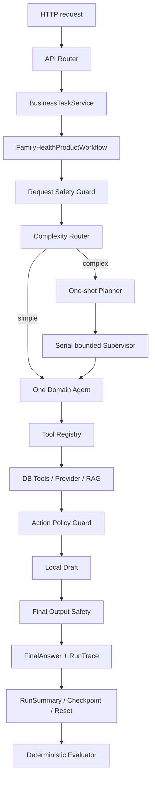

# 核心代码走读：从 HTTP 请求到 Supervisor、Safety 和 Evaluator

> 这是一份面向初学者的代码学习文档。它参考了 [smart-cs-multi-agent 的 code-walkthrough](https://github.com/bcefghj/smart-cs-multi-agent/blob/main/docs/code-walkthrough.md) 的组织方式：先定位核心代码，再解释状态、调用关系、设计选择和面试表达。
>
> 参考仓库还展示了 MCP、OpenTelemetry、并行 Agent 等实现，但这些不是本项目最终 4B 架构的一部分。本文件只讲本仓库真实存在的代码；对于“有契约但没有真实外部联调”的部分，会明确标注。

## 0. 先建立一个正确的阅读方式

读任何一个函数时，固定问六个问题：

1. 它的输入是什么，输入由谁创建？
2. 它的输出是什么，输出被谁消费？
3. 它是在做 Python 语法、框架适配，还是业务决策？
4. 它有没有副作用，例如数据库写入、HTTP 调用或状态修改？
5. 它失败时抛出什么错误，错误在哪里转换成 API 响应？
6. 它如何证明自己的结果可信：Pydantic、成员作用域、来源指针、Safety 还是幂等键？

本项目最重要的学习目标不是记住 `Supervisor` 这个名字，而是看懂下面这条数据流：



## 1. 核心文件地图

| 关注点 | 代码位置 | 先看什么 |
| --- | --- | --- |
| HTTP 入口 | `backend/app/api/routes/business_tasks.py` | `create_task`、`confirm_task` |
| 业务 Service | `backend/app/services/business_task_service.py` | `create_task`、`confirm_task`、`_persist_state` |
| LangGraph 业务图 | `backend/app/agent/product_workflow.py` | `ProductWorkflowState`、`_build_graph`、`invoke`、`resume_confirmation` |
| 复杂度路由 | `backend/app/agent/complexity_router.py` | `DeterministicComplexityRouter.route` |
| Planner/Supervisor | `backend/app/agent/orchestration.py` | `DeterministicTaskPlanner.plan`、`DeterministicBoundedSupervisor.run` |
| 领域 Agent | `backend/app/agent/domain_agents.py` | `DomainAgentInput`、`DomainAgent.execute`、三个具体 Agent |
| 运行时安全 | `backend/app/agent/safety_confirmation.py` | `ThreeLayerSafetyGuard`、`ConfirmationStateMachine` |
| 上下文 | `backend/app/agent/context_manager.py` | `build_envelope`、`build_role_view`、`compact`、`reset_after_run` |
| 模型调用 | `backend/app/agent/model_gateway.py` | `ModelGateway.invoke`、`create_model_gateway` |
| 工具门面 | `backend/app/tools/tool_registry.py` | `ToolRegistry.call` |
| RAG | `backend/app/rag/retriever.py` | `HybridRetriever.retrieve`、来源回填 |
| 冻结产物 | `backend/app/agent/product_artifacts.py` | `build_run_trace`、`build_context_envelope` |
| 评估 | `backend/app/agent/evaluator.py`、`harness_runner.py` | `evaluate`、`aggregate` |
| 状态持久化 | `backend/app/services/checkpoint_service.py`、`task_checkpoint_cache.py` | PostgreSQL 权威、Redis TTL 回源 |

阅读顺序建议：先读第 2 节的完整请求链路，再分别读 Supervisor、Safety、Tool/RAG、Trace/Evaluator。不要一上来从 `product_workflow.py` 第一行读到最后一行，它同时承担状态图、工具调用、Provider、确认和产物投影，初学者容易迷路。

## 2. 从 API 入口开始：谁创建了什么对象

### 2.1 Router 只负责协议转换

入口文件是 `backend/app/api/routes/business_tasks.py`。它接收 HTTP JSON、读取当前 demo user、创建数据库 Session，并把已经校验过的字段传给 `BusinessTaskService`。

可以把路由层理解成一个适配器：

```python
@router.post("/business-tasks")
def create_task(request: BusinessTaskCreate, db: Session = Depends(get_db)):
    execution = BusinessTaskService(db, user_id=DEMO_USER_ID).create_task(
        business_domain=request.business_domain,
        member_id=request.member_id,
        user_input=request.user_input,
        input_payload=request.input_payload,
        idempotency_key=request.idempotency_key,
        provider_mode=request.provider_mode,
    )
    return BusinessTaskResponse.from_execution(execution)
```

上面代码里的 `request` 是 Pydantic DTO，不是数据库对象；`db` 是 SQLAlchemy `Session`，由 FastAPI 的依赖注入创建；`BusinessTaskService` 才是业务流程的入口。Router 不应该自己写 SQL，也不应该决定“是否安全”。

### 2.2 Service 负责幂等、事务和工作流生命周期

`BusinessTaskService.create_task` 的关键顺序是：

1. 校验当前用户是否拥有 `member_id`。
2. 根据请求计算 `request_fingerprint`。
3. 查询同用户、同 `idempotency_key` 的旧任务。
4. 如果已有相同指纹，返回 replay；如果指纹不同，返回 409 冲突。
5. 创建 `BusinessTask` 和 `AgentRun`。
6. 创建 `FamilyHealthProductWorkflow` 并调用 `workflow.invoke(...)`。
7. 把工作流状态投影为 checkpoint、run trace 和业务响应。
8. 在外层事务中 commit；完成后才发布 Redis 短期缓存。

这就是为什么数据库 Session 不是“普通参数”：它决定了对象是否在同一个事务里，决定了发生异常时哪些记录一起提交或回滚。

## 3. Workflow State：系统内部的数据总线

`backend/app/agent/product_workflow.py` 的 `ProductWorkflowState` 是 LangGraph 节点之间共享的结构化状态：

```python
class ProductWorkflowState(TypedDict, total=False):
    run_id: str
    task_id: str
    user_id: str
    member_id: str
    business_domain: BusinessDomain
    user_input: str
    input_payload: dict[str, Any]
    safety_flags: list[str]
    source_refs: list[dict[str, Any]]
    tool_calls: list[dict[str, Any]]
    confirmation_state: ConfirmationState
    final_answer: str
    visited_nodes: list[str]
```

它不是数据库表，也不是直接返回给前端的 DTO，而是一次 run 的 working state。节点读它、修改它、把它交给下一个节点；run 结束后，`product_artifacts.py` 会把它转换成冻结的 `RunTrace`、`RunSummary` 和 `EvaluationResult`。

这里有一个非常重要的边界：

- `ProductWorkflowState` 可以有临时字段。
- `RunTrace` 只能保存允许审计的冻结字段。
- API 响应还要经过响应 schema，不能直接把整个 state 返回给客户端。

### 3.1 状态图如何建立

`FamilyHealthProductWorkflow._build_graph` 注册节点和边，核心结构是：

```python
graph.add_node("safety_entry", self._safety_entry)
graph.add_node("preconsultation", self._preconsultation)
graph.add_node("chronic_care", self._chronic_care)
graph.add_node("health_record", self._health_record)
graph.add_node("safety_review", self._safety_review)
graph.add_node("confirm", self._confirm)
graph.add_node("generate_final_answer", self._generate_final_answer)
graph.add_node("finalize", self._finalize)

graph.set_entry_point("safety_entry")
graph.add_conditional_edges("safety_entry", self._route_after_entry)
graph.add_conditional_edges("safety_review", self._route_after_review)
graph.add_edge("generate_final_answer", "finalize")
graph.add_edge("finalize", END)
```

学习时重点看两件事：

1. **条件边决定控制流**：例如高风险请求不能进入普通业务节点。
2. **固定边决定治理顺序**：Safety、确认、最终答案和冻结产物不能由模型随意跳过。

这和普通 `if/else` 的区别是，状态图把“允许经过哪些节点”显式建模了，后续可以对节点访问和终止条件做测试。

## 4. Router、Planner、Supervisor 到底分别做什么

这是本项目最容易被混淆的部分。

### 4.1 Complexity Router：判断任务复杂度

文件：`backend/app/agent/complexity_router.py`。

`DeterministicComplexityRouter.route` 只做确定性判断：

- 发现胸痛、呼吸困难、停药、加量等高风险信号，直接路由安全相关领域。
- 只命中一个业务领域，返回 `simple_single_domain`。
- 同时命中两个或更多领域，返回 `complex_cross_domain`，并设置 `requires_planner=True`。
- 没有足够信号时返回澄清所需的结构化结果。

它不调用 LLM、数据库或业务 Tool。因此它解决的是“要不要进入复杂编排”，不是“下一步做什么”。

### 4.2 Planner：一次性生成计划

文件：`backend/app/agent/orchestration.py`，`DeterministicTaskPlanner.plan`。

计划代码的核心逻辑是：

```python
steps = []
for index, role in enumerate(route.target_roles, start=1):
    dependencies = (steps[-1].step_id,) if steps else ()
    steps.append(
        PlanStep(
            step_id=f"step_{index}",
            role=role,
            objective=OBJECTIVES[role],
            dependencies=dependencies,
        )
    )
```

例如一个同时涉及症状和用药的问题，Planner 可能生成：

```text
step_1: TriageAgent
step_2: MedicationAgent, depends_on step_1
```

Planner 的输出是 `TaskPlan`，包含目标、角色、依赖和最大步数。Planner 决定“要完成哪些步骤、步骤之间有什么依赖”，它不执行 Tool，也不直接生成最终答案。

### 4.3 Supervisor：执行已经冻结的计划

文件：`backend/app/agent/orchestration.py`，`DeterministicBoundedSupervisor.run`。

Supervisor 的职责是：

1. 简单任务直接调用一个领域 Agent。
2. 复杂任务读取 Planner 已生成的步骤。
3. 检查当前步骤的依赖是否完成。
4. 调用对应角色，并验证返回的 `task_id/member_id/role/step_id` 没有漂移。
5. 对声明为 `retryable` 的失败做有限重试。
6. 遇到澄清、终止失败、超步数或超角色调用次数时停止。
7. 所有步骤完成后输出 `finish` 决策。

核心控制结构可以简化为：

```python
for step in plan.steps:
    if dependencies_not_satisfied(step):
        return stop("step_dependency_not_satisfied")

    while True:
        if too_many_steps() or too_many_role_calls(step.role):
            return stop("bounded_limit_exceeded")

        result = execute_step(step)

        if result.status in {"blocked", "failed"} and result.retryable:
            retry_once_within_bound()
            continue

        if result.status == "needs_clarification":
            return stop("needs_clarification")

        mark_step_completed(step)
        break

return finish("all_plan_steps_completed")
```

这里的 `while True` 不等于无限循环，因为每一轮都受到 `max_supervisor_steps`、`max_role_calls` 和重试次数限制。这是 bounded Supervisor 的工程价值：即使 Agent 返回异常，也必须能终止。

### 4.4 Planner 和 Supervisor 不冗余

可以这样记：

> Planner 决定“要完成什么”；Supervisor 决定“按照计划下一步由谁执行，并且什么时候停止”。

如果把两者合成一个大 Agent，计划生成和计划执行会混在一起，难以测试“计划是否正确”和“执行是否越界”。拆开后，可以分别测试：

- Planner：最多 3 步、依赖正确、角色合法。
- Supervisor：不跳依赖、不超步数、不无限重试、不调用计划外角色。

## 5. 领域 Agent：为什么不是三个自由聊天机器人

文件：`backend/app/agent/domain_agents.py`。

### 5.1 统一输入

```python
class DomainAgentInput(ContractModel):
    route: ComplexityRoute
    step: PlanStep
    user_input_summary: SummaryText
    allowed_tools: tuple[NonEmptyStr, ...]
    prior_results: tuple[AgentTaskResult, ...]
```

它没有 `raw_conversation` 字段，只有摘要、冻结路由、当前步骤、工具白名单和同成员的结构化前序结果。Pydantic validator 还会检查：

- 当前步骤角色必须属于冻结 route。
- 工具必须属于该角色 allowlist。
- 前序结果的 `task_id` 和 `member_id` 必须一致。

这同时是契约校验和上下文隔离防线。

### 5.2 统一输出

抽象基类 `DomainAgent.execute` 先确认当前步骤角色与 Agent 角色一致，然后调用 `_execute`。具体 Agent 返回 `AgentTaskResult`，而不是随意字符串：

```python
return AgentTaskResult(
    task_id=..., member_id=..., agent_role=self.role,
    step_id=..., status="completed",
    facts={"workflow_action": "prepare_medication_workflow"},
    tool_calls=(),
    requested_confirmation=True,
)
```

三个 Agent 的边界：

- `TriageAgent`：整理症状、红旗信号和缺失槽位，不诊断。
- `MedicationAgent`：整理处方、药箱、库存、续方和提醒草稿，不改剂量、不下单。
- `ReportAgent`：整理报告任务和来源解释需求，不篡改报告、不生成无来源诊断。

注意：任务六中的三个领域 Agent 是确定性编排内核，它们本身不直接读取医疗数据。实际业务 Workflow 通过 Tool Registry 读取数据库和 Provider。不要把“Agent 的能力 allowlist”误认为“Agent 已经获得了数据”。

## 6. SafetyAgent 与确认状态机

### 6.1 三层安全治理

文件：`backend/app/agent/safety_confirmation.py`，类 `ThreeLayerSafetyGuard`。

三层的顺序是：

1. `request(...)`：用户请求刚进入时，识别严重症状、停药、加量、换药、越权成员和绕过确认。
2. `action(...)`：准备写入草稿或执行受保护动作时，检查角色、成员、动作类型、版本和人工确认。
3. `final_output(...)`：最终答案返回前，检查危险表达、无来源医疗结论和必要提示。

示意代码：

```python
request_decision = safety_guard.request(
    user_input=user_input,
    member_id=member_id,
)
if request_decision.blocked:
    return blocked_state(request_decision)

action_decision = safety_guard.action(
    action_type=action_type,
    confirmation_scope=scope,
    human_confirmation_present=confirmed,
)
if action_decision.blocked:
    return blocked_state(action_decision)

final_decision = safety_guard.final_output(
    output=final_answer,
    source_refs=source_refs,
)
```

SafetyAgent 是运行时拦截器。它在答案或动作产生前参与业务流程。

### 6.2 ConfirmationStateMachine：只允许合法状态迁移

同一文件中的 `ConfirmationStateMachine.transition` 维护：

```text
NONE -> DRAFT
DRAFT -> CONFIRMED
CONFIRMED -> EXECUTED
DRAFT -> REJECTED
```

关键规则：

- 没有用户确认，不能从 `DRAFT` 进入 `CONFIRMED`。
- 只有 `CONFIRMED` 才能进入 `EXECUTED`。
- `user_id`、`member_id`、`task_id`、`draft_id`、版本、指纹和幂等键不匹配时返回冲突。
- 已经执行过的相同幂等请求可以 replay，但不能再次执行。

当前系统只执行本地状态和本地 draft，不向医院、药店或通知服务提交真实动作。

### 6.3 SafetyAgent 和 EvaluatorAgent 的区别

| 角色 | 运行时机 | 能否阻断业务 | 能否修改答案 |
| --- | --- | --- | --- |
| SafetyAgent | 请求、动作、最终答案之前 | 可以 | 可以阻止答案/动作进入下一节点 |
| EvaluatorAgent | FinalAnswer、RunTrace 冻结之后 | 不参与业务执行 | 不可以，只读记录评估结果 |

把二者混成一个 Agent，会让“裁判”参与“比赛”，也会让评估逻辑有机会改变用户答案。

## 7. ContextManager：控制每个角色能看到什么

文件：`backend/app/agent/context_manager.py`。

### 7.1 `build_envelope`

`build_envelope` 把用户输入摘要、任务身份、成员、槽位、安全标记、Tool evidence refs 和 RAG source refs 组装为 `ContextEnvelope`。它保存的是来源指针，而不是所有原始正文。

### 7.2 `build_role_view`

它根据 `agent_role` 投影最小视图：

```python
allowed_tools = self._visible_tools(
    envelope.allowed_tools,
    agent_role,
    extra_allowed_tools or [],
)
return RoleSpecificContextView(
    run_id=envelope.run_id,
    task_id=envelope.task_id,
    agent_role=agent_role,
    member_id=envelope.member_id,
    intent=envelope.intent,
    allowed_tools=allowed_tools,
    visible_task_state=...,
    visible_tool_evidence_refs=...,
    visible_rag_source_refs=...,
    safety_flags=...,
)
```

它明确拒绝为 `EvaluatorAgent` 创建业务写上下文；Evaluator 只读冻结产物。

### 7.3 `compact`

压缩只接受同一个 `task_id`、同一个 `member_id` 的 Envelope。它合并槽位、来源、工具证据和安全标记，但保留 `source_id`、`tool_call_id`、`member_id`。因此 compact 是“把对话变短”，不是“把来源删掉”。

### 7.4 `reset_after_run`

run 结束时生成 `RunSummary`，然后返回一个清理结果：

```python
return ResetContextState(
    run_summary=summary,
    retained_tool_evidence_refs=...,
    retained_rag_source_refs=...,
    run_trace_ref=f"run_trace:{run_trace.run_id}",
    final_answer_ref=summary.final_answer_ref,
    evaluation_ref=summary.evaluation_ref,
    working_context_cleared=True,
    cleared_fields=[
        "candidate_inferences",
        "raw_conversation",
        "scratchpad",
        "temporary_tool_outputs",
    ],
)
```

保留的是审计和来源指针；清理的是临时推理、完整聊天和 scratchpad。它不删除数据库中的 `RunTrace` 或 checkpoint。

## 8. Tool Registry、数据库工具和 Provider

### 8.1 为什么 Agent 不能直接调用数据库

Agent 只知道工具名和 Pydantic 输入输出契约。真正的 `Session`、当前用户、当前成员和权限由服务端注入 `ToolExecutionContext`。这样可以避免模型自己传入一个伪造的 `user_id` 或查询别的成员。

典型调用关系：

```text
Domain Agent
  -> ToolRegistry.call(tool_name, input_data, execution_context)
      -> input schema validation
      -> role/permission/member scope
      -> handler
          -> SQLAlchemy Repository/Service
          -> ProviderRegistry
          -> HybridRetriever
      -> ToolResult
      -> ToolCallTrace
```

### 8.2 ToolResult 是失败边界

工具失败不能只抛一个无结构的字符串。`ToolResult` 至少要表达：

- `success`
- `data`
- `source_refs`
- `error_type/error_category`
- `retryable`
- `degraded`
- `attempts`

参数错误、权限错误、schema 错误和写操作不自动重试；只读 timeout、rate limit 和临时 Provider 不可用才允许有限重试。失败的 Provider 不能携带业务 data 或 SourceRef，防止降级摘要被误当成事实。

### 8.3 事务边界

任务 Service 拥有外层事务。确认草稿 Tool 使用 savepoint，不在 Tool 内部随意 `commit()` 或 `rollback()`。这样：

- Tool 自己的失败可以撤销自己的草稿写入。
- 外层已经创建的 AgentRun 和审计记录不会一起丢失。
- 最终由 Service 统一提交业务状态、checkpoint 和 trace。

这是任务十二真实 PostgreSQL 验收中修复并测试的关键边界。

## 9. RAG：从查询到 SourceRef

文件：`backend/app/rag/retriever.py`、`vector_store.py`、`vector_backend.py`。

### 9.1 当前链路

```text
RetrievalRequest
  -> keyword search
  -> optional vector search
  -> RRF merge by rank
  -> document/chunk/version/schema validation
  -> PostgreSQL source hydration
  -> RetrievedChunk / SourceRef
```

关键词适合药品名、指标名和标准编号；向量适合自然语言表达；hybrid 使用 RRF 合并 rank，不直接比较关键词分数和向量分数的不同量纲。

### 9.2 deterministic 和 FastEmbed 的区别

- deterministic hash provider：不下载模型，保证测试可重复；不能证明语义相似度质量。
- FastEmbed provider：通过 CPU/ONNX 生成真实 embedding，需要模型和缓存目录；当前代码路径已提供，但真实语义 Recall@K 仍需要独立 gold set 和 benchmark。
- PostgreSQL + pgvector：保存向量和版本元数据；真正的正文仍从权威知识表回填。

个人处方、报告、药箱和库存不进入个人向量记忆；这些事实必须从业务数据库或 Provider 重新读取。

## 10. Model Gateway：如何让 LLM 可选而不阻塞项目

文件：`backend/app/agent/model_gateway.py`。

### 10.1 Provider 抽象

```python
class ModelProvider(Protocol):
    @property
    def provider_name(self) -> str: ...

    def invoke(self, request: ModelCallRequest) -> ProviderRawResponse: ...
```

目前有：

- `DeterministicModelProvider`：默认 provider，用固定函数产生结构化内容。
- `OpenAICompatibleModelProvider`：根据服务端配置调用兼容 HTTP 接口。

### 10.2 Gateway 的安全顺序

`ModelGateway.invoke` 不把 provider 原始文本直接交给 Agent，而是：

```text
provider.invoke
  -> JSON parse
  -> response_model.model_validate
  -> ModelOutputSafetyChecker
  -> success output
```

任一步失败都会记录 `ModelProviderAttemptTrace`。配置 fallback 时再调用 deterministic provider；fallback 也失败，就返回没有 output 的结构化失败，不能把未校验原文当成答案。

因此当前项目可以“无 Key 运行”，但不等于“真实 LLM 已完成质量验收”。真实模型需要在未提交的 `.env` 中配置：

```env
MODEL_PROVIDER=openai_compatible
MODEL_API_BASE=https://your-provider.example/v1
MODEL_API_KEY=your-real-key
MODEL_NAME=your-real-model-name
```

## 11. RunTrace、Observation 和产物冻结

### 11.1 RunTrace 是什么

文件：`backend/app/agent/run_trace_schemas.py`。

`RunTrace` 是一次运行完成后的只读快照，包含：

- `run_id/task_id/user_id/member_id`
- `intent`
- `ToolCallTrace`
- `RAGTrace`
- `SafetyTrace`
- `FinalAnswerTrace`
- `ObservationTrace`
- `latency_ms`

`FrozenTraceModel` 使用 `extra="forbid"` 和 `frozen=True`，含义是：评估阶段不能偷偷增加字段，也不能修改已经冻结的运行产物。

### 11.2 Observation 不是业务证据

`ObservationTrace` 只记录节点、工具、Provider、来源 ID、耗时、重试、fallback 和 token 计数。它不保存请求正文、Prompt、Tool/Provider payload、最终答案正文或 API Key。Observation 用来排障，不用来代替处方、库存或知识正文。

### 11.3 `product_artifacts.py` 是投影层

`add_product_artifacts` 的顺序是：

```text
workflow state
  -> build_run_trace
  -> build_expected_case
  -> DeterministicEvaluator.evaluate
  -> build_context_envelope
  -> ContextManager.create_run_summary
  -> 写回 state
```

它不负责执行数据库查询或业务 Tool，只把已经完成的 state 转换成审计和评测契约。

## 12. Evaluator 和 Harness：如何计算“成功”

### 12.1 DeterministicEvaluator 的规则

文件：`backend/app/agent/evaluator.py`。

它读取 ExpectedCase 和 RunTrace，逐项检查：

1. intent 是否匹配。
2. member_id 是否匹配。
3. required tools 是否覆盖。
4. expected safety flags 是否覆盖。
5. 需要确认时是否出现等待用户确认。
6. forbidden phrase 是否出现在最终答案。
7. expected source 是否可在 Tool evidence 或 RAG trace 找到。
8. 有事实性回答但没有来源时，groundedness 是否失败。
9. 所有 schema 是否有效。
10. 所有 Tool/RAG/Safety 的 member_id 是否一致。

```python
task_success = all(
    (
        intent_matches,
        member_matches,
        tool_call_accuracy == 1.0,
        safety_recall in (None, 1.0),
        not expected_human_confirmation_required or human_confirmation_present,
        not matched_forbidden_phrases,
        groundedness == 1.0,
        schema_valid,
        context_isolation_passed,
    )
)
```

这不是 LLM Judge，不判断“回答听起来像不像人”，而是判断冻结产物是否满足明确契约。

### 12.2 HarnessRunner 如何聚合

文件：`backend/app/agent/harness_runner.py`。

`HarnessRunner.run` 先加载 JSON fixture，再用 Pydantic 校验 ExpectedCase 和 RunTrace，按 `case_id` 对齐，最后逐条调用 Evaluator。它聚合：

- task success rate
- tool call accuracy average
- groundedness rate
- schema valid rate
- hallucination rate
- safety recall rate
- human confirmation rate
- context isolation pass rate
- nearest-rank p95 latency

如果 case 和 trace 的 ID 集合不一致，Runner 直接失败，避免“少跑几条 case 但报告仍然成功”。

## 13. 状态持久化：PostgreSQL、Redis 和 Context Reset 的配合

最终分层架构不是“所有状态都塞进 Redis”：

```text
LangGraph Working State
    -> single run temporary state
PostgreSQL Task Checkpoint
    -> authoritative RunSummary, confirmation, frozen refs
Redis
    -> TTL projection and coordination only
    -> miss/expired/error => PostgreSQL fallback
```

首次 run 生成本地 DRAFT 并冻结产物；用户确认时创建同一 `task_id` 下的新 run，用 `parent_run_id` 关联上一轮，从 PostgreSQL 恢复最小 checkpoint，并重新读取可能变化的处方、库存和报告事实。

系统明确不保存长期完整聊天、不建立个人健康向量记忆、不允许模型直接写医疗事实。

## 14. 测试应该如何对应代码

| 测试文件 | 证明什么 |
| --- | --- |
| `test_complexity_router.py` | 简单/复杂/高风险/歧义路由 |
| `test_orchestration_contracts.py` | Plan、Agent result、Supervisor decision schema |
| `test_domain_orchestration.py` | 三个领域 Agent 和 bounded Supervisor |
| `test_safety_confirmation.py` | 三层安全、状态迁移、幂等、作用域冲突 |
| `test_task_checkpoint_cache.py` | PostgreSQL checkpoint、Redis miss/TTL/作用域 |
| `test_provider_reliability.py` | timeout、retry、degraded、schema failure |
| `test_hybrid_rag.py`、`test_vector_rag.py` | keyword/vector/RRF、版本和 fallback |
| `test_task10_observability.py` | 脱敏 Observation 和成员隔离 |
| `test_ablation_harness.py` | 32 条 fixture 的 A/B/C 公平消融 |
| `test_deterministic_evaluator.py` | 单条 RunTrace 的规则计算 |
| `test_business_task_api.py` | API、数据库事务、确认续跑和业务边界 |
| `test_task12_acceptance.py` | 任务十二验收报告格式 |

运行后端：

```powershell
$env:PYTHONPATH=(Resolve-Path 'backend').Path
.\.venv\Scripts\python.exe -m pytest backend\tests -q -p no:cacheprovider --basetemp=.tmp\pytest-core-walkthrough
.\.venv\Scripts\python.exe -m compileall backend\app backend\tests
```

运行前端：

```powershell
Set-Location frontend
npm test
npm run typecheck
npm run build
```

运行 Docker 真实后端验收：

```powershell
Set-Location E:\project_code\hospital
$env:RAG_VECTOR_ENABLED='true'
$env:RAG_EMBEDDING_PROVIDER='deterministic'
$env:RAG_EMBEDDING_MODEL='deterministic-hash-v1'
$env:RAG_EMBEDDING_DIMENSIONS='512'
docker compose up -d --build --wait --wait-timeout 300
.\.venv\Scripts\python.exe scripts\task12_acceptance.py --require-vector
```

## 15. 建议的学习练习

### 练习一：画一次简单请求

选择“给父亲整理续方材料”，沿着 `business_tasks.py -> BusinessTaskService -> ProductWorkflowState -> chronic_care -> tools -> final answer` 画箭头，并在每个箭头旁写出输入和输出。

### 练习二：画一次复杂请求

选择同时包含“症状”和“用药”的请求，记录：

- Router 为什么返回 `complex_cross_domain`。
- Planner 生成了哪些 `PlanStep`。
- Supervisor 如何检查 dependency。
- 哪个 Agent 的失败可以 retry，哪个失败会 stop。

### 练习三：故意破坏成员隔离

在测试 fixture 中把某一个 ToolCall 的 `member_id` 改成另一个成员，观察 Evaluator 的 `context_isolation_passed` 和 `failure_reasons`。

### 练习四：故意删掉来源

保留最终答案中的事实性内容，但删除 Tool evidence 和 RAG source，观察 `groundedness`、`hallucination_detected` 和 `task_success` 的变化。

### 练习五：故意绕过确认

把确认状态从 `DRAFT` 直接改成 `EXECUTED`，观察 `ConfirmationStateMachine` 为什么拒绝；再用同一个幂等键重复请求，观察 replay 和 conflict 的区别。

### 练习六：读懂一次事务失败

在 Confirmation Tool 中制造校验失败，检查为什么 Tool 使用 savepoint，为什么外层 `AgentRun` 仍然能够保留审计记录。

## 16. 面试时怎么讲这套代码

可以这样回答：

> 我没有把多 Agent 做成多个自由聊天机器人，而是先用 Complexity Router 区分简单单领域和复杂跨领域请求。简单请求直接进入一个领域 Agent；复杂请求由一次性 Planner 生成最多三步的结构化计划，再由串行 bounded Supervisor 按依赖执行，并限制最大步数、角色调用次数和重试次数。业务 Agent 只能通过 Tool Registry 获取带成员作用域和来源指针的事实。请求、动作和最终答案分别经过三层 Agent 安全；答案和 Trace 冻结后，再由只读 Deterministic Evaluator 按工具覆盖、来源、确认、Safety、schema 和成员隔离规则评估。无 Key 时使用 deterministic provider，真实模型只是可配置的 OpenAI-compatible 适配路径，不能把本地 fixture 指标说成线上或临床指标。

追问“为什么要 Planner 和 Supervisor”时：

> Planner 负责一次性决定任务分解和依赖，Supervisor 负责执行已经冻结的计划并保证有界终止。拆开后，计划正确性和执行安全性可以分别测试，也能避免模型在执行过程中无限重规划。

追问“多 Agent 的收益是什么”时，不要只说“更智能”，而要说：

- 角色工具和上下文更小，减少无关信息和跨成员污染。
- 复杂任务可以保留结构化 handoff 和依赖。
- Safety、Tool、Evaluator 治理节点不由业务 Agent 自由跳过。
- 通过 A/B/C Harness 比较工具 exact-match、重复调用、任务成功率、来源和延迟，而不是凭感觉宣称多 Agent 更好。

## 17. 当前实现与非目标

已经实现并验证：

- 本地 Docker PostgreSQL、Redis、FastAPI 和 Next.js 链路。
- 结构化 Planner、三个领域 Agent、串行 bounded Supervisor。
- 三层 Safety、Confirmation State Machine、Tool Registry、RAG SourceRef。
- PostgreSQL checkpoint、Redis TTL 回源、RunTrace、Observation 和 Deterministic Evaluator。

仍未真实验证或明确不做：

- 真实医院、药店、通知和支付 Provider。
- 真实 LLM 的回答质量、token 成本和线上延迟。
- FastEmbed 语义召回质量和生产知识摄取流水线。
- MCP Server、OpenTelemetry/Jaeger、Agent 级并行和复杂自动重规划。
- 生产认证、HTTPS、备份、高可用和医疗合规。

这份文档是学习用代码地图，不替代 [开发总路线图](../DEVELOPMENT_ROADMAP.md)、[技术设计](../TECH_DESIGN.md) 或 [API 文档](../API_SPEC.md)。
