# 核心代码走读：从 HTTP 请求到编排、安全与评测

> 阅读约定：正文尽量使用中文。只有代码中的真实类名、字段名和面试常用技术名保留英文，例如 `RAG`、`token`、`ReAct`、`Supervisor`。第一次出现时会先解释用途，不要求先背单词。

> 这是一份面向初学者的代码学习文档。它参考了 [smart-cs-multi-agent 的 code-walkthrough](https://github.com/bcefghj/smart-cs-multi-agent/blob/main/docs/code-walkthrough.md) 的组织方式：先定位核心代码，再解释状态、调用关系、设计选择和面试表达。
>
> 参考仓库还展示了 MCP、OpenTelemetry、并行 Agent 等实现，但这些不是本项目最终 4B 架构的一部分。本文件只讲本仓库真实存在的代码；对于“有契约但没有真实外部联调”的部分，会明确标注。

## 0. 先建立一个正确的阅读方式

读任何一个函数时，固定问六个问题：

1. 它的输入是什么，输入由谁创建？
2. 它的输出是什么，输出被谁消费？
3. 它是在做 Python 语法、框架适配，还是业务决策？
4. 它有没有副作用，例如数据库写入、HTTP 调用或状态修改？
5. 它失败时抛出什么错误，错误在哪里转换成 API 响应？
6. 它如何证明自己的结果可信：Pydantic、成员作用域、来源指针、Safety 还是幂等键？

本项目最重要的学习目标不是记住 `Supervisor` 这个名字，而是看清“谁决定执行、谁真正执行、谁负责治理”。当前 `/api/business-tasks` 已经把三者接成同一条业务链；`/api/agent-runs` 仍保留为前端兼容入口，单独阅读时不要把它当成新业务主链。

```mermaid
flowchart TD
    subgraph Runtime["当前真实 API / Docker 业务链"]
        A["POST /api/business-tasks"] --> B["API Router"]
        B --> C["BusinessTaskService"]
        C --> D["UnifiedHealthGraph"]
        D --> E["Complexity Router"]
        E -->|"simple"| F["SupervisorBusinessWorkflow"]
        E -->|"complex"| PLANNER["one-shot Planner"]
        PLANNER --> F
        F --> G["Runtime Triage / Medication / Report Agent"]
        G --> H["Tool Registry / DB / Provider / RAG"]
        H --> I["AgentTaskResult + ToolEvidence"]
        I --> J["Safety + Confirmation"]
        J --> K["FinalAnswer / Trace / Checkpoint / Evaluator"]
    end

    subgraph Compatible["患者端 /agent 当前兼容链"]
        N["POST /api/agent-runs"] --> O["AgentRuntimeService"]
        O --> COMP_WORKFLOW["LangGraphAgentWorkflow"]
        COMP_WORKFLOW --> COMP_TOOLS["旧角色工具链 / Safety / Frozen artifacts"]
    end

    subgraph Kernel["同一 Supervisor 的离线契约内核"]
        REQUEST["ComplexityRoutingRequest"] --> R["Deterministic Router"]
        R --> S["DeterministicBoundedSupervisor"]
        S --> T["AgentTaskResult / Ablation Harness"]
    end
```



必须记住当前接线事实：

- `/api/business-tasks` 由 `BusinessTaskService` 创建 `UnifiedHealthGraph`；统一图进入 `SupervisorBusinessWorkflow`，Supervisor 再创建本次 run 的三个运行时领域 Agent，并让被选中的 Agent 通过 Tool Registry 获取事实。
- 患者端 `/agent` 页面当前仍调用 `/api/agent-runs`，由 `AgentRuntimeService` 执行兼容的 `LangGraphAgentWorkflow`；所以浏览器 E2E 验证的是这条患者端兼容链。
- `DeterministicComplexityRouter`、`DeterministicTaskPlanner`、`DeterministicBoundedSupervisor` 负责确定性编排；`runtime_domain_agents.py` 中的三个运行时 Agent 才负责真实 Tool 调用。两者都返回结构化 `AgentTaskResult`，但运行时 Agent 额外携带 Tool evidence 和 source refs。
- 正式业务入口当前强制串行 bounded Supervisor，避免多个角色竞争同一个确认和写入作用域；独立编排内核仍保留只读 DAG 并行能力，用于受控实验和评测。`FamilyHealthProductWorkflow` 只作为兼容基类，提供 Safety、Confirmation、FinalAnswer 和 artifact helper，不再是默认业务分支选择器。

为什么会有两套 API：`/api/agent-runs` 是早期 Agent Runtime 与当前前端演示的兼容入口；`/api/business-tasks` 是 4B 新增的分层状态、Provider、Safety 和确认状态机入口。保留兼容入口有利于不破坏旧页面，但也产生了技术债：面试和文档必须说清“哪条链验证了什么”，最终产品若继续演进，应选择唯一运行入口并迁移前端，而不是长期维护两套主流程。

### 0.1 读代码前先认识这些 Python 写法

| 写法 | 用中文怎么读 | 在项目中的作用 |
| --- | --- | --- |
| `name: str` | 变量 `name` 预期是字符串 | 类型提示，便于 IDE、Pydantic 和 review；Python 运行时不一定自动校验 |
| `str | None` | 字符串或者空值 `None` | 表示可选字段；使用前通常要先判断是否为空 |
| `list[str]` | 元素都是字符串的可变列表 | 适合逐步 `append`，例如收集 `failure_reasons` |
| `tuple[str, ...]` | 任意多个字符串组成的不可变元组 | 适合冻结计划、角色和工具白名单 |
| `dict[str, Any]` | key 是字符串，value 可以是任意类型 | 承载尚未细分 DTO 的 JSON 对象；不能滥用，否则失去契约保护 |
| `self.xxx` | 当前类实例自己的属性 | 例如 `self.db` 是这一份 Service 使用的数据库 Session |
| `@router.post(...)` | 装饰器 | FastAPI 在函数定义时把函数登记成 HTTP 接口 |
| `@model_validator(mode="after")` | Pydantic 模型级校验器 | 所有字段先解析完成，再检查字段之间的关系 |
| `*`（函数参数中） | 后面的参数必须写名字 | `plan(route=...)` 比位置参数更不容易传错身份和版本 |
| `*items`（列表中） | 解包可迭代对象 | 把多个来源列表展开后再合并 |
| `**mapping` | 解包字典为关键字参数 | 常用于受控复制；身份字段不能让请求字典随意覆盖 |
| `x or default` | `x` 为空时使用默认值 | `input_payload or {}` 防止后面操作 `None` |
| `x is None` | 判断是否就是空值 | 比 `if not x` 更精确，不会把 `0`、空列表一起当成空值 |
| `{item for item in items}` | 集合推导式 | 去重并用于集合包含判断，例如工具覆盖 |
| `[item for item in items if ...]` | 列表推导式 | 过滤并保留顺序，例如找出缺失工具 |
| `raise ApiError(...)` | 主动抛出异常 | 中断当前路径，由 FastAPI 的异常处理器转换成 HTTP 响应 |
| `try / except / finally` | 尝试、分类处理异常、最后清理 | 数据库失败回滚，`finally` 中关闭模型 HTTP client |

本文代码块里的中文注释是“教学副本”。你应该对照真实文件阅读，不要把每一句解释原样复制进生产源码；生产注释只保留业务边界和不直观的原因。

## 1. 核心文件地图

| 关注点 | 代码位置 | 先看什么 |
| --- | --- | --- |
| HTTP 入口 | `backend/app/api/routes/business_tasks.py` | `create_task`、`confirm_task` |
| 业务 Service | `backend/app/services/business_task_service.py` | `create_task`、`confirm_task`、`_persist_state` |
| 统一业务入口 | `backend/app/agent/unified_health_graph.py`、`supervised_workflow.py` | `UnifiedHealthGraph`、`SupervisorBusinessWorkflow.invoke`、`resume_confirmation` |
| 业务 working state / 兼容图 | `backend/app/agent/product_workflow.py` | `ProductWorkflowState`、Safety/Confirmation/FinalAnswer helper |
| 运行时领域 Agent | `backend/app/agent/runtime_domain_agents.py` | Tool-backed `RuntimeTriageAgent`、`RuntimeMedicationAgent`、`RuntimeReportAgent` |
| 患者端兼容 Runtime | `backend/app/api/routes/agent_audit.py`、`services/agent_runtime_service.py` | `/agent` 页面当前实际调用的 create/continue run |
| 复杂度路由 | `backend/app/agent/complexity_router.py` | `DeterministicComplexityRouter.route` |
| Planner/Supervisor | `backend/app/agent/orchestration.py` | `DeterministicTaskPlanner.plan`、`DeterministicBoundedSupervisor.run` |
| 领域 Agent | `backend/app/agent/domain_agents.py` | `DomainAgentInput`、`DomainAgent.execute`、三个具体 Agent |
| 运行时安全 | `backend/app/agent/safety_confirmation.py` | `ThreeLayerSafetyGuard`、`ConfirmationStateMachine` |
| 上下文 | `backend/app/agent/context_manager.py` | `build_envelope`、`build_role_view`、`compact`、`reset_after_run` |
| 模型调用 | `backend/app/agent/model_gateway.py` | `ModelGateway.invoke`、`create_model_gateway` |
| 工具门面 | `backend/app/tools/tool_registry.py` | `ToolRegistry.call` |
| RAG | `backend/app/rag/retriever.py` | `HybridRetriever.retrieve`、来源回填 |
| 冻结产物 | `backend/app/agent/product_artifacts.py` | `build_run_trace`、`build_context_envelope` |
| 评估 | `backend/app/agent/evaluator.py`、`harness_runner.py` | `evaluate`、`aggregate` |
| 状态持久化 | `backend/app/services/checkpoint_service.py`、`task_checkpoint_cache.py` | PostgreSQL 权威、Redis TTL 回源 |

阅读顺序建议：先读第 2 节的完整请求链路，再分别读 Supervisor、Safety、Tool/RAG、Trace/Evaluator。不要一上来从 `product_workflow.py` 第一行读到最后一行，它同时承担状态图、工具调用、Provider、确认和产物投影，初学者容易迷路。

## 2. 从 API 入口开始：谁创建了什么对象

### 2.1 Router 只负责协议转换

入口文件是 `backend/app/api/routes/business_tasks.py`。它接收 HTTP JSON、读取当前 demo user、创建数据库 Session，并把已经校验过的字段传给 `BusinessTaskService`。

可以把路由层理解成一个适配器。下面是当前真实接口的教学注释版：

```python
@router.post(                         # 调用 APIRouter 的 post 方法，注册 POST 接口。
    "",                               # router 已有 /business-tasks 前缀，所以完整路径仍是 /api/business-tasks。
    response_model=BusinessTaskExecutionResponse,  # FastAPI 用此 Pydantic DTO 校验并生成响应文档。
    status_code=status.HTTP_201_CREATED,            # 创建成功时返回 HTTP 201。
)
def create_business_task(             # def 表示定义函数；函数名供 Python 内部使用。
    request: BusinessTaskCreateRequest, # request 来自 HTTP JSON，FastAPI 自动解析和校验。
    db: DbSession,                      # db 是 SQLAlchemy Session，由 FastAPI 依赖注入创建。
    demo_user: DemoUser,                # demo_user 是服务端识别出的当前用户，不信任请求体传 user_id。
) -> BusinessTaskExecutionResponse:     # -> 是返回类型提示，说明最终必须返回响应 DTO。
    execution = BusinessTaskService(    # execution 是局部变量，保存 Service 返回的完整执行结果。
        db,                              # 把同一个数据库事务 Session 交给 Service。
        user_id=demo_user.id,            # 身份来自服务端依赖，不来自用户 JSON。
    ).create_task(                       # 先创建 Service 实例，再调用它的 create_task 方法。
        business_domain=request.business_domain,
        member_id=request.member_id,
        user_input=request.user_input,
        input_payload=request.input_payload,
        idempotency_key=request.idempotency_key,
        provider_mode=request.provider_mode,
        thread_id=request.thread_id,
        human_confirmation_granted=request.human_confirmation_granted,
    )
    return _execution_response(execution) # 把 ORM + workflow state 投影成前端允许看到的 DTO。
```

变量从哪里来、到哪里去：

| 变量 | 谁创建 | 实际类型 | 交给谁 |
| --- | --- | --- | --- |
| `request` | FastAPI 根据 HTTP JSON 创建 | `BusinessTaskCreateRequest` | 拆出业务字段交给 Service |
| `db` | `get_db` 依赖在请求开始时创建 | SQLAlchemy `Session` | `BusinessTaskService`、Workflow、Tool 共用事务 |
| `demo_user` | `get_demo_user` 根据服务端配置和数据库创建 | ORM `User` | 只取可信 `id` 建立作用域 |
| `execution` | `BusinessTaskService.create_task` 返回 | `BusinessTaskExecution` dataclass | `_execution_response` 投影为 API DTO |

`request.business_domain` 不是“调用 `business_domain` 方法”。点号在这里表示“读取 `request` 对象的属性”。`request` 先被 Pydantic 校验，所以这些属性已经具有声明的类型。

Router 不应该自己写 SQL，也不应该决定“是否安全”。它只处理 HTTP、依赖和 DTO 转换。

### 2.2 Service 负责幂等、事务和工作流生命周期

`BusinessTaskService.create_task` 的关键顺序是：

1. 校验当前用户是否拥有 `member_id`。
2. 根据请求计算 `request_fingerprint`。
3. 查询同用户、同 `idempotency_key` 的旧任务。
4. 如果已有相同指纹，返回 replay；如果指纹不同，返回 409 冲突。
5. 创建 `BusinessTask` 和 `AgentRun`。
6. 创建 `UnifiedHealthGraph` 并调用 `graph.invoke(...)`；统一图默认使用 `SupervisorBusinessWorkflow`。
7. 把工作流状态投影为 checkpoint、run trace 和业务响应。
8. 在外层事务中 commit；完成后才发布 Redis 短期缓存。

这就是为什么数据库 Session 不是“普通参数”：它决定了对象是否在同一个事务里，决定了发生异常时哪些记录一起提交或回滚。

## 3. 运行状态：系统内部的数据总线

`backend/app/agent/product_workflow.py` 的 `ProductWorkflowState` 是业务执行过程中共享的结构化 working state。它现在由 `SupervisorBusinessWorkflow` 复用，承载 Tool 结果、来源、确认和最终答案；它不是“由某个 business_domain 节点直接决定执行”的路由表：

```python
class ProductWorkflowState(TypedDict, total=False):
    run_id: str
    task_id: str
    user_id: str
    member_id: str
    business_domain: BusinessDomain
    user_input: str
    input_payload: dict[str, Any]
    safety_flags: list[str]
    source_refs: list[dict[str, Any]]
    tool_calls: list[dict[str, Any]]
    confirmation_state: ConfirmationState
    final_answer: str
    visited_nodes: list[str]
```

它不是数据库表，也不是直接返回给前端的 DTO，而是一次 run 的 working state。节点读它、修改它、把它交给下一个节点；run 结束后，`product_artifacts.py` 会把它转换成冻结的 `RunTrace`、`RunSummary` 和 `EvaluationResult`。

这里有一个非常重要的边界：

- `ProductWorkflowState` 可以有临时字段。
- `RunTrace` 只能保存允许审计的冻结字段。
- API 响应还要经过响应 schema，不能直接把整个 state 返回给客户端。

### 3.1 状态图如何建立

当前默认入口的 `UnifiedHealthGraph._build_graph` 只有一个业务执行节点：

```python
graph.add_node("supervised_execution", self._business_graph_node)
graph.add_edge(START, "supervised_execution")
graph.add_edge("supervised_execution", END)
```

这不是把所有业务逻辑塞进一个节点。`_business_graph_node` 调用的
`SupervisorBusinessWorkflow` 内部按固定顺序完成：

```text
Request Safety
  -> Complexity Router
  -> one-shot Planner（仅复杂任务）
  -> bounded Supervisor
       -> Runtime TriageAgent / MedicationAgent / ReportAgent
            -> Tool Registry -> DB / Provider / RAG
  -> Action Safety / Confirmation
  -> FinalAnswer
```

因此要分清两层：`UnifiedHealthGraph` 是统一入口和生命周期边界；
`SupervisorBusinessWorkflow` 是业务执行协调器；三个运行时领域 Agent 才是
被 Supervisor 选中并实际调用 Tool 的执行者。旧的
`FamilyHealthProductWorkflow._build_graph` 仍用于兼容 helper 和局部旧测试，
但默认业务入口不会根据 `business_domain` 直接跳进它的
`_chronic_care`、`_health_record` 或 `_preconsultation` 节点。

学习时重点看三件事：

1. **统一图节点决定生命周期**：输入和输出都经过同一个可审计边界。
2. **Supervisor 决定实际执行角色**：用户文字由 Router 形成目标角色，Supervisor 调用对应运行时 Agent，外部 `business_domain` 只是任务上下文默认值。
3. **固定方法顺序决定治理**：Safety、确认、最终答案和冻结产物不能由模型随意跳过。

这和普通 `if/else` 的区别是，状态图把统一入口显式建模，而 Supervisor
又把“允许哪个领域 Agent 执行、该 Agent 能调用哪些 Tool”通过 Pydantic
契约和 Registry 权限校验固定下来。测试可以同时检查图的访问顺序、真实 Tool
调用、未选角色未被调用以及终止原因。

## 4. Router、Planner、Supervisor 到底分别做什么

这是本项目最容易被混淆的部分。

### 4.1 Complexity Router：判断任务复杂度

文件：`backend/app/agent/complexity_router.py`。

`DeterministicComplexityRouter.route` 只做确定性判断：

- 发现胸痛、呼吸困难、停药、加量等高风险信号，直接路由安全相关领域。
- 只命中一个业务领域，返回 `simple_single_domain`。
- 同时命中两个或更多领域，返回 `complex_cross_domain`，并设置 `requires_planner=True`。
- 没有足够信号时返回澄清所需的结构化结果。

它不调用 LLM、数据库或业务 Tool。因此它解决的是“要不要进入复杂编排”，不是“下一步做什么”。

### 4.2 Planner：一次性生成计划

文件：`backend/app/agent/orchestration.py`，`DeterministicTaskPlanner.plan`。

先要区分“契约支持依赖”和“Planner 生成依赖”。`PlanStep.dependencies` 与 `DeterministicBoundedSupervisor` 支持显式 DAG；当前 `DeterministicTaskPlanner.plan` 会根据 `ComplexityRoute.dependency_hints` 生成确定性业务边，再做拓扑排序。没有明确顺序的并列请求不会被强行制造依赖；这正是安全边界的一部分。

当前代码的核心逻辑更接近：

```python
ordered_roles = _topological_roles(route)  # 把有明确上游关系的角色排到下游角色前面。
role_to_step_id = {                       # 先建立“角色 -> 稳定 step_id”的映射。
    role: f"step_{index}"
    for index, role in enumerate(ordered_roles, start=1)
}
dependencies_by_role = {                  # 把角色级提示转换成 step 级依赖。
    role: tuple(
        role_to_step_id[hint.upstream_role]
        for hint in route.dependency_hints
        if hint.downstream_role == role
    )
    for role in ordered_roles
}

steps: list[PlanStep] = []                # 保存最终冻结的业务步骤。
for index, role in enumerate(ordered_roles, start=1):
    allowed_tools = tuple(allowed_tools_for_role(role))  # 该步骤的完整工具上限。
    steps.append(
        PlanStep(
            step_id=f"step_{index}",
            role=role,
            objective=_OBJECTIVES[role],
            dependencies=dependencies_by_role[role],
            allowed_tools=allowed_tools,
            # 包含草稿/写入工具时不能作为并行只读步骤。
            read_only=all(tool in _READ_ONLY_TOOLS for tool in allowed_tools),
        )
    )
```

这段代码执行多轮时，变量的变化如下：

| 时刻 | `index` | `role` | `steps` 原来有什么 | 新 `dependencies` |
| --- | ---: | --- | --- | --- |
| 第一轮 | 1 | `TriageAgent` | `[]` | `()` |
| 第二轮 | 2 | `MedicationAgent` | 已有 `step_1` | 由 `DependencyHint` 决定 |
| 第三轮 | 3 | `ReportAgent` | 已有前两步 | 由 `DependencyHint` 决定 |

这里的 `()` 是空元组，表示该请求没有明确的业务先后关系，不代表 Planner 永远不会生成依赖。存在“先看报告/症状，再准备续方”语义时，Planner 会把 `ReportAgent`/`TriageAgent` 的步骤放到上游，并把对应 step id 写入 `MedicationAgent.dependencies`；`TaskPlan` 再校验这些边是否合法。

4D-B5.2 已把“报告解读结果用于续方材料整理”表达为真正的业务边：

```text
step_1: ReportAgent
step_2: MedicationAgent, depends_on step_1
```

这是有明确顺序表达时的行为，不是当前所有输入都会得到的结果。安全检查、确认、最终答案冻结和 Evaluator 属于固定治理边，不应被塞进 Supervisor 的业务依赖集合。Planner 决定“要完成哪些业务步骤、业务步骤之间有什么依赖”，它不执行 Tool，也不直接生成最终答案。

### 4.3 Supervisor：执行已经冻结的计划

文件：`backend/app/agent/orchestration.py`，`DeterministicBoundedSupervisor.run`。

Supervisor 的职责是：

1. 简单任务直接调用一个领域 Agent。
2. 复杂任务读取 Planner 已生成的步骤。
3. 检查当前步骤的依赖是否完成。
4. 调用对应角色，并验证返回的 `task_id/member_id/role/step_id` 没有漂移。
5. 对声明为 `retryable` 的失败做有限重试。
6. 遇到澄清、终止失败、超步数或超角色调用次数时停止。
7. 所有步骤完成后输出 `finish` 决策。

先看真实函数开头的变量。它们都是一次 `run` 内的局部状态，函数返回后不会成为全局变量：

```python
results: list[AgentTaskResult] = []    # 保存每一次 Agent 调用结果，重试也会产生一条结果。
decisions: list[SupervisorDecision] = [] # 保存 call/retry/stop/finish 等调度决定。
completed_steps: set[str] = set()      # set 自动去重，用来快速判断依赖是否已完成。
role_calls: dict[DomainAgentRole, int] = {} # 统计每个角色调用次数，防止单角色无限重试。
degraded = False                       # 只要任一步降级，就在最终状态中保留该事实。

for step in plan.steps:                # 读取冻结计划；评测内核可选受控只读并行，正式业务路径传入 execution_mode="serial"。
    if not set(step.dependencies).issubset(completed_steps):
        # issubset 的含义是：当前步骤要求的每一个依赖，都必须已经出现在 completed_steps。
        return self._stopped_run(       # return 立即结束整个函数，不再执行后续 Agent。
            request,
            route,
            plan,
            results,
            decisions,
            "step_dependency_not_satisfied",
        )

    attempt = 1                         # 当前步骤第一次调用；重试时递增。
    while True:                         # 这里是循环，但下方有三个硬上限，所以不是自由死循环。
        if len(results) >= self.max_supervisor_steps:
            return self._stopped_run(..., "max_supervisor_steps_exceeded")

        calls_for_role = role_calls.get(step.role, 0)
        # dict.get(key, 0)：角色从未调用时返回默认值 0，不会抛 KeyError。
        if calls_for_role >= self.max_role_calls:
            return self._stopped_run(..., "max_role_calls_exceeded")
```

再看状态分支的简化版：

```python
for step in plan.steps:
    if dependencies_not_satisfied(step):
        return stop("step_dependency_not_satisfied")

    while True:
        if too_many_steps() or too_many_role_calls(step.role):
            return stop("bounded_limit_exceeded")

        result = execute_step(step)

        if result.status in {"blocked", "failed"} and result.retryable:
            retry_once_within_bound()
            continue

        if result.status == "needs_clarification":
            return stop("needs_clarification")

        mark_step_completed(step)
        break

return finish("all_plan_steps_completed")
```

这里的 `while True` 不等于无限循环，因为每一轮都受到 `max_supervisor_steps`、`max_role_calls` 和重试次数限制。这是 bounded Supervisor 的工程价值：即使 Agent 返回异常，也必须能终止。

Supervisor 里最值得学的变量：

| 变量 | 类型 | 为什么这样设计 |
| --- | --- | --- |
| `plan` | `TaskPlan` | 一次性冻结，执行时不能随意增加角色或改目标 |
| `results` | `list[AgentTaskResult]` | 保留每次尝试，便于 Trace 和失败分析 |
| `decisions` | `list[SupervisorDecision]` | 把“为什么重试/停止”变成结构化证据 |
| `completed_steps` | `set[str]` | 高效检查依赖，且不会重复保存同一 step id |
| `role_calls` | `dict[role, int]` | 分角色限制调用次数，不让某一个 Agent 吞掉全部预算 |
| `attempt` | `int` | 当前步骤第几次尝试，和全局 `len(results)` 是两个不同维度 |

### 4.4 Planner 和 Supervisor 不冗余

可以这样记：

> Planner 决定“要完成什么”；Supervisor 决定“按照计划下一步由谁执行，并且什么时候停止”。

如果把两者合成一个大 Agent，计划生成和计划执行会混在一起，难以测试“计划是否正确”和“执行是否越界”。拆开后，可以分别测试：

- Planner：最多 3 步、依赖正确、角色合法。
- Supervisor：不跳依赖、不超步数、不无限重试、不调用计划外角色。

## 5. 领域 Agent：为什么不是三个自由聊天机器人

文件：`backend/app/agent/domain_agents.py`。

### 5.1 统一输入

```python
class DomainAgentInput(ContractModel):       # 继承 ContractModel，因此 extra 字段会被拒绝。
    route: ComplexityRoute                  # Router 的冻结结果，包含 task/member/roles。
    step: PlanStep                          # Supervisor 当前要求执行的唯一一步。
    user_input_summary: SummaryText         # 最多 2000 字摘要，不是完整 raw conversation。
    allowed_tools: tuple[NonEmptyStr, ...] = Field(
        default_factory=tuple               # 每次创建一个新空 tuple，避免共享可变默认值。
    )
    prior_results: tuple[AgentTaskResult, ...] = Field(
        default_factory=tuple               # 只接收已经结构化、同 task/member 的前序结果。
    )
```

`ContractModel` 是项目的 Pydantic 基类。这里写类不是为了“存数据到数据库”，而是定义 Agent 之间允许交换的数据形状。创建 `DomainAgentInput(...)` 时，Pydantic 会先校验字段类型，再运行 `validate_agent_scope` 检查角色、工具和成员关系。

为什么 `prior_results` 用元组而不是列表：输入一旦交给领域 Agent，就应该按冻结快照读取；领域 Agent 不应该 `append` 或修改其他 Agent 的结果。

它没有 `raw_conversation` 字段，只有摘要、冻结路由、当前步骤、工具白名单和同成员的结构化前序结果。Pydantic validator 还会检查：

- 当前步骤角色必须属于冻结 route。
- 工具必须属于该角色 allowlist。
- 前序结果的 `task_id` 和 `member_id` 必须一致。

这同时是契约校验和上下文隔离防线。

### 5.2 统一输出

抽象基类 `DomainAgent.execute` 先确认当前步骤角色与 Agent 角色一致，然后调用 `_execute`。具体 Agent 返回 `AgentTaskResult`，而不是随意字符串：

```python
return AgentTaskResult(
    task_id=..., member_id=..., agent_role=self.role,
    step_id=..., status="completed",
    facts={"workflow_action": "prepare_medication_workflow"},
    tool_calls=(),
    requested_confirmation=True,
)
```

三个 Agent 的边界：

- `TriageAgent`：整理症状、红旗信号和缺失槽位，不诊断。
- `MedicationAgent`：整理处方、药箱、库存、续方和提醒草稿，不改剂量、不下单。
- `ReportAgent`：整理报告任务和来源解释需求，不篡改报告、不生成无来源诊断。

这里展示的是 `domain_agents.py` 中的纯 deterministic Agent，主要用于编排契约和离线消融。正式业务入口使用 `runtime_domain_agents.py` 中的同名运行时角色；它们仍然不直接拿数据库 Session，而是通过 `RuntimeAgentContext.call_tool(...)` 请求 Tool Registry。这样既保留了可重复的离线内核，又让生产业务路径可以证明“Supervisor 真的调用了哪个 Agent 和哪个 Tool”。

### 5.3 运行时 Agent 如何真正调用 Tool

文件：`backend/app/agent/runtime_domain_agents.py`、`backend/app/agent/supervised_workflow.py`。

先看运行时 Agent 能看到的最小能力接口：

```python
class RuntimeAgentContext(Protocol):
    # Protocol 只描述“可以调用哪些方法”，不负责创建具体对象。
    # 这样 RuntimeMedicationAgent 不需要知道 SQLAlchemy Session 在哪里。
    run_id: str
    member_id: str

    def call_tool(
        self,
        *,
        agent_role: DomainAgentRole,
        tool_name: str,
        payload: dict[str, Any],
    ) -> ToolResult: ...
```

`Protocol` 是 Python 的结构化接口：只要一个对象拥有这些属性和方法，类型检查器就认为它可以作为运行时上下文。真正的对象是 `SupervisorAgentRuntime`，它把 Agent 的请求转给 `workflow._call(...)`；`_call` 再把请求交给 Tool Registry。因此调用链是：

```text
RuntimeMedicationAgent
  -> RuntimeAgentContext.call_tool
  -> SupervisorAgentRuntime.call_tool
  -> SupervisorBusinessWorkflow._call (shared Tool boundary)
  -> ToolRegistry.call
  -> DB/Provider/RAG handler
```

下面是一个简化但对应真实结构的用药 Agent 片段：

```python
profile = self._call(
    agent_input,
    tool_name="query_health_profile",
    payload={
        "user_id": self.runtime.user_id,
        "member_id": self.runtime.member_id,
    },
)

if isinstance(profile, AgentTaskResult):
    # _call 失败时返回结构化 AgentTaskResult，而不是抛出未分类字符串。
    # 立即 return 能阻止后续 Agent 在没有健康档案的情况下继续编造事实。
    return profile

box = self._call(
    agent_input,
    tool_name="query_medicine_box",
    payload={"member_id": self.runtime.member_id},
)
```

每个变量的含义：

- `agent_input`：Supervisor 为当前 step 创建的最小输入，包含 task/member、当前角色和工具候选，不含完整聊天历史。
- `tool_name`：字符串工具名，但最终会被 Tool Registry 查表并按 `ToolSpec` 校验，Agent 不能凭空调用任意函数。
- `payload`：传给工具的业务参数；成员身份还会在 ToolExecutionContext 和 Repository SQL 再校验一次。
- `profile` / `box`：成功时是 `ToolResult`，失败时 `_call` 转成 `AgentTaskResult`，所以后续逻辑只消费结构化结果。

运行时 Agent 完成后，`RuntimeDomainAgent._result(...)` 会把本次调用之后新增的工具名和证据指针带回：

```python
return AgentTaskResult(
    task_id=agent_input.route.task_id,       # 防止结果属于别的任务。
    member_id=agent_input.route.member_id,   # 防止结果串到别的家庭成员。
    agent_role=self.role,                    # 必须与 Supervisor 当前 step 一致。
    step_id=agent_input.step.step_id,        # 让 reducer 和 Trace 找回这一步。
    status="completed",                     # 结构化状态，不用自然语言猜成功与否。
    facts={"workflow_action": "prepare_medication_workflow"},
    source_refs=self.runtime.evidence_refs_since(self._trace_start),
    tool_calls=self.runtime.tool_names_since(self._trace_start),
)
```

这就是本次修复的关键：`SupervisorBusinessWorkflow._runtime_supervisor(...)` 每次 run 都创建一个新的运行时 Agent registry；Supervisor 选择 `MedicationAgent` 时，真正执行的是 `RuntimeMedicationAgent`，而不是只在 `orchestration_run` 里写一条角色名称。测试因此可以断言：未选中的 `ReportAgent` 没有 Tool call，跨领域请求同时出现两个角色的真实 Tool call，所有 call 的 `member_id` 都等于当前任务成员。

## 6. SafetyAgent 与确认状态机

### 6.1 三层安全治理

文件：`backend/app/agent/safety_confirmation.py`，类 `ThreeLayerSafetyGuard`。

三层的顺序是：

1. `request(...)`：用户请求刚进入时，识别严重症状、停药、加量、换药、越权成员和绕过确认。
2. `action(...)`：准备写入草稿或执行受保护动作时，检查角色、成员、动作类型、版本和人工确认。
3. `final_output(...)`：最终答案返回前，检查危险表达、无来源医疗结论和必要提示。

下面是与当前真实方法签名一致的教学注释版：

```python
request_decision = safety_guard.request(
    message=user_input,                  # 本轮用户输入；这里只做规则检查，不改写正文。
    member_id=member_id,                 # 当前任务已校验的成员身份，用于写入 SafetyDecision。
)
if request_decision.blocked:             # blocked 是 Pydantic 对象上的 bool 字段。
    return blocked_state(request_decision) # return 立即停止普通业务节点。

action_decision = safety_guard.action(
    message=user_input,                  # 再检查动作上下文中的医疗风险。
    user_id=user_id,                     # 本次动作携带的用户身份。
    member_id=member_id,                 # 本次动作携带的家庭成员身份。
    expected_user_id=task.user_id,       # PostgreSQL 任务记录中的权威用户身份。
    expected_member_id=task.member_id,   # PostgreSQL 任务记录中的权威成员身份。
    confirmation_state=current_state,    # 当前权威确认状态，如 DRAFT 或 CONFIRMED。
    human_confirmation_present=confirmed, # 用户是否在本次请求中明确确认。
)
if action_decision.blocked:
    return blocked_state(action_decision)

final_decision, output_result = safety_guard.final_output(
    output=candidate_answer,             # 已生成但尚未发送给用户的候选 DTO/字符串。
    member_id=member_id,
)
```

三个返回值都不是最终业务答案：`request_decision` 和 `action_decision` 是结构化 `SafetyDecision`；`output_result` 是最终输出门禁结果。`final_output` 返回二元组，所以左侧必须用两个变量“拆包”。来源完整性由 Tool/RAG、冻结产物和 Evaluator 检查，Safety Guard 负责危险表达、作用域和确认门禁，职责不能混在一起。

SafetyAgent 是运行时拦截器。它在答案或动作产生前参与业务流程。

### 6.2 ConfirmationStateMachine：只允许合法状态迁移

同一文件中的 `ConfirmationStateMachine.transition` 维护：

```text
NONE -> DRAFT
DRAFT -> CONFIRMED
CONFIRMED -> EXECUTED
DRAFT -> REJECTED
```

关键规则：

- 没有用户确认，不能从 `DRAFT` 进入 `CONFIRMED`。
- 只有 `CONFIRMED` 才能进入 `EXECUTED`。
- `user_id`、`member_id`、`task_id`、`draft_id`、版本、指纹和幂等键不匹配时返回冲突。
- 已经执行过的相同幂等请求可以 replay，但不能再次执行。

当前系统只执行本地状态和本地 draft，不向医院、药店或通知服务提交真实动作。

下面用 `confirm` 分支学习状态机代码：

```python
if action == "confirm":                    # == 比较值；这里只处理“确认”事件。
    if current == "CONFIRMED":             # 相同请求已经成功确认过。
        return self._success(                # replay=True 表示安全重放，不重复执行副作用。
            scope,
            state="CONFIRMED",
            replay=True,
        )

    if current != "DRAFT":                 # != 表示不等于；只有草稿允许被确认。
        return self._failure(
            scope,
            state=current,
            code="invalid_state_transition",
            reason="only a DRAFT can be confirmed",
        )

    if not request.human_confirmation_present: # not 把 False 取反为 True，进入失败分支。
        return self._failure(
            scope,
            state="DRAFT",                 # 失败后仍留在 DRAFT，不能偷偷推进状态。
            code="human_confirmation_required",
            reason="explicit user confirmation is required",
            requires_confirmation=True,
        )

    return self._success(scope, state="CONFIRMED") # 身份、状态、安全、确认都通过才迁移。
```

`current` 来自 PostgreSQL 权威 checkpoint，`action` 来自本次受控状态机调用，`scope` 同时绑定 `user_id/member_id/task_id/draft_id/version/idempotency_key/fingerprint`。因此状态机比较的不只是一个字符串状态。

### 6.3 SafetyAgent 和 EvaluatorAgent 的区别

| 角色 | 运行时机 | 能否阻断业务 | 能否修改答案 |
| --- | --- | --- | --- |
| SafetyAgent | 请求、动作、最终答案之前 | 可以 | 可以阻止答案/动作进入下一节点 |
| EvaluatorAgent | FinalAnswer、RunTrace 冻结之后 | 不参与业务执行 | 不可以，只读记录评估结果 |

把二者混成一个 Agent，会让“裁判”参与“比赛”，也会让评估逻辑有机会改变用户答案。

## 7. ContextManager：控制每个角色能看到什么

文件：`backend/app/agent/context_manager.py`。

先分清一个容易混淆的点：`ContextManager` 本身不是数据库，也不是长期记忆服务。它是一个纯 Python 转换器，只接收已经得到的数据，再构造、裁剪、压缩和清理上下文。真正的持久化由 PostgreSQL 检查点和确认偏好服务完成，Redis 只做带 TTL 的短期缓存。

### 7.1 `build_envelope`

`build_envelope` 把用户输入摘要、任务身份、成员、槽位、安全标记、Tool evidence refs 和 RAG source refs 组装为 `ContextEnvelope`。它保存的是来源指针，而不是所有原始正文。

初学时可以把它理解成“给这一次任务建立资料袋”：

```python
summary = self._summarize_user_input(user_input)
# 调用当前类的私有辅助方法，把多余空白合并，并把过长输入截到 160 个字符。
# 这里不是调用 LLM，也不是把摘要写入数据库。

task_state = TaskState(
    missing_slots=missing_slots or [],
    # 左边是字段名，右边是函数参数。
    # `or []` 表示调用者没传列表时使用空列表，避免后面遍历 None。

    confirmed_slots=confirmed_slots or {},
    # 已经由用户、Tool 或可信流程确认的槽位。

    pending_confirmations=pending_confirmations or [],
    # 仍在等待用户确认的动作或信息。

    candidate_inferences=candidate_inferences or {},
    # 模型候选推断单独存放，不能自动升级为事实或长期记忆。
)
```

`run_id` 标识本次运行，`task_id` 标识可以跨多次 run 继续的业务任务，`member_id` 标识当前家庭成员。三者解决的问题不同，不能只保留一个编号。

### 7.2 `build_role_view`

它根据 `agent_role` 投影最小视图：

```python
allowed_tools = self._visible_tools(
    envelope.allowed_tools,              # 任务整体允许的工具集合。
    agent_role,                           # 当前要投影给哪个角色。
    extra_allowed_tools or [],            # None 不能直接迭代，因此为空时变成新列表。
)
return RoleSpecificContextView(
    run_id=envelope.run_id,              # 身份字段原样传递，不能由模型生成。
    task_id=envelope.task_id,
    agent_role=agent_role,
    member_id=envelope.member_id,        # 角色视图始终绑定一个家庭成员。
    intent=envelope.intent,
    allowed_tools=allowed_tools,         # 是角色白名单和任务白名单的受控交集。
    visible_task_state=self._visible_task_state(envelope, agent_role),
    visible_tool_evidence_refs=self._visible_tool_evidence(envelope, agent_role),
    visible_rag_source_refs=self._visible_rag_sources(envelope, agent_role),
    safety_flags=self._visible_safety_flags(envelope, agent_role),
)
```

它明确拒绝为 `EvaluatorAgent` 创建业务写上下文；Evaluator 只读冻结产物。

这里连续调用多个 `_visible_xxx`，不是重复代码，而是分别执行四种裁剪策略：任务字段、工具证据、RAG 来源和安全标记的可见规则并不相同。返回对象没有 `raw_conversation` 字段，所以即使调用者想传完整历史，Pydantic 也不会接受。

### 7.3 `compact`

压缩只接受同一个 `task_id`、同一个 `member_id` 的 Envelope。它合并槽位、来源、工具证据和安全标记，但保留 `source_id`、`tool_call_id`、`member_id`。因此 compact 是“把对话变短”，不是“把来源删掉”。

代码先用集合检查作用域：

```python
task_ids = {envelope.task_id for envelope in envelopes}
# 集合推导式：遍历每个 envelope，只保留不重复的 task_id。

member_ids = {envelope.member_id for envelope in envelopes}

if len(task_ids) != 1:
    raise ValueError("compact only supports contexts from the same task_id")
# 不等于 1 说明混入了别的任务，立即失败，不让模型决定是否可以合并。

if len(member_ids) != 1:
    raise ValueError("compact only supports contexts from the same member_id")
# 家庭成员不同同样立即失败，这是成员隔离的硬规则。
```

什么时候调用 compact，不由“模型觉得历史太长”决定。当前实现适用于同一任务多轮补充、确认续跑前整理、重复来源去重。项目还没有 token 阈值自动触发器；以后若增加，阈值也只能触发这套确定性压缩规则，不能放宽成员和来源检查。

### 7.4 `reset_after_run`

run 结束时生成 `RunSummary`，然后返回一个清理结果：

```python
return ResetContextState(
    run_summary=summary,
    retained_tool_evidence_refs=...,
    retained_rag_source_refs=...,
    run_trace_ref=f"run_trace:{run_trace.run_id}",
    final_answer_ref=summary.final_answer_ref,
    evaluation_ref=summary.evaluation_ref,
    working_context_cleared=True,
    cleared_fields=[
        "candidate_inferences",
        "raw_conversation",
        "scratchpad",
        "temporary_tool_outputs",
    ],
)
```

保留的是审计和来源指针；清理的是临时推理、完整聊天和 scratchpad。它不删除数据库中的 `RunTrace` 或 checkpoint。

### 7.5 记忆不是完整聊天历史

`MemoryRef` 的数据契约位于 `context_schemas.py`：

```python
class MemoryRef(ContractModel):
    memory_id: NonEmptyStr          # 一条长期信息的稳定编号。
    member_id: NonEmptyStr          # 这条信息属于哪个家庭成员。
    memory_type: NonEmptyStr        # 例如提醒展示偏好，不能伪装成医疗事实。
    source_id: NonEmptyStr          # 指向产生该偏好的已确认来源。
    source_type: MemorySourceType   # 来源种类，便于审计。
    confirmed_by_user: bool         # 用户是否明确确认。

    @model_validator(mode="after")
    def reject_unconfirmed_memory(self) -> "MemoryRef":
        if not self.confirmed_by_user:
            raise ValueError("memory_refs only accept user-confirmed content")
        return self
```

`@model_validator(mode="after")` 是 Pydantic 的对象级校验：所有字段先完成类型检查，再运行这个函数。只要 `confirmed_by_user` 是 `False`，对象就无法创建，因此未确认内容不是“创建后再提醒开发者别用”，而是在契约边界直接失败。

这还不是最终数据库写入。`ConfirmedPreferenceService` 会继续检查：

1. 当前任务已经完成确认。
2. `user_id/member_id/task_id` 一致。
3. 来源存在于当前任务，并且版本没有过期。
4. 偏好不是诊断、处方、剂量、报告或药箱事实。
5. 幂等键和偏好版本没有冲突。

所以项目的长期记忆只保存用户确认的非医疗偏好。处方、报告、药箱和库存每次从业务数据库或 Provider 重新查询；`RAG` 保存公共知识，也不属于个人记忆。

### 7.6 哪些信息保留，哪些信息删除

读代码时不要用“句子长不长”判断重要性，要按下面四个问题判断：

1. 是否属于当前 `task_id`？
2. 是否属于当前 `member_id`？
3. 是否完成当前任务还需要？
4. 如果它是事实，是否存在 `source_id` 或 Tool 调用来源？

符合条件的任务状态、确认状态、安全标记和来源指针保留；完整旧对话、scratchpad、临时 Tool/Provider 正文和未确认候选推断删除。可变医疗事实只保留指针，续跑时重新查询，不把旧副本当成最新事实。

### 7.7 上下文和记忆怎么测试

当前测试不是让 LLM 主观评分，而是制造错误并检查系统是否拒绝：

| 测试 | 故意制造的问题 | 正确结果 |
| --- | --- | --- |
| `test_agent_contract_schemas.py` | 把完整聊天塞进角色视图 | Pydantic 校验失败 |
| `test_context_manager.py` | 混合 task/member，或 compact 后删除来源 | 拒绝合并，来源保持 |
| `test_context_manager.py` | reset 时存在未确认推断 | 不进入 `memory_refs` |
| `test_task_checkpoint_cache.py` | Redis 过期、损坏或作用域错误 | cache miss，并回源 PostgreSQL |
| `test_preference_service.py` | 无确认、跨成员或来源版本过期 | 拒绝写入长期偏好 |
| `test_deterministic_evaluator.py` | RunTrace 的成员不一致 | `context_isolation_passed=false` |

这些测试证明规则边界，但不能直接换算成“记忆准确率”。独立指标需要固定多轮评测集，比较压缩、重置和 Checkpoint 恢复前后的关键信息保留率、来源保留率、未确认写入率、跨成员泄漏率和 token 降幅；当前规则见 [上下文管理](../CONTEXT_MANAGEMENT.md)。

## 8. Tool Registry、数据库工具和 Provider

### 8.1 为什么 Agent 不能直接调用数据库

Agent 只知道工具名和 Pydantic 输入输出契约。真正的 `Session`、当前用户、当前成员和权限由服务端注入 `ToolExecutionContext`。这样可以避免模型自己传入一个伪造的 `user_id` 或查询别的成员。

典型调用关系：

```text
Domain Agent
  -> ToolRegistry.call(tool_name, input_data, execution_context)
      -> input schema validation
      -> role/permission/member scope
      -> handler
          -> SQLAlchemy Repository/Service
          -> ProviderRegistry
          -> HybridRetriever
      -> ToolResult
      -> ToolCallTrace
```

### 8.2 ToolResult 是失败边界

工具失败不能只抛一个无结构的字符串。`ToolResult` 至少要表达：

- `success`
- `data`
- `source_refs`
- `error_type/error_category`
- `retryable`
- `degraded`
- `attempts`

参数错误、权限错误、schema 错误和写操作不自动重试；只读 timeout、rate limit 和临时 Provider 不可用才允许有限重试。失败的 Provider 不能携带业务 data 或 SourceRef，防止降级摘要被误当成事实。

`ToolRegistry.call` 最关键的前半段可以这样读：

```python
started = perf_counter()                    # 读取高精度单调时钟，只用于计算耗时。
spec = self._specs.get(tool_name)           # 用工具名查 ToolSpec；get 找不到时返回 None。
if spec is None:
    return self._failure(...)               # 未注册工具直接结构化失败，handler 不会执行。

if tool_name not in execution_context.allowed_tools:
    return self._failure(...)               # 任务上下文没有授权，即使 Registry 有工具也不能调。

if execution_context.agent_role not in spec.allowed_agent_roles:
    return self._failure(...)               # ToolSpec 再检查一次角色白名单，形成双重约束。

validated_input = spec.input_schema.model_validate(tool_input)
# model_validate 把 dict 解析为 Pydantic 输入 DTO；字段缺失、类型错误或 extra 字段都会失败。

attempts: list[ToolAttemptTrace] = []        # 保存每次尝试；失败后重试也必须可审计。
max_attempts = spec.retry_policy.max_attempts if spec.read_only else 1
# 条件表达式：只读工具使用配置上限；写工具固定 1 次，避免重复副作用。

for attempt_no in range(1, max_attempts + 1):
    raw_output = self._handlers[tool_name](  # handler 才是真正做 SQL、Provider 或 RAG 的函数。
        validated_input,
        execution_context,
    )

validated_output = spec.output_schema.model_validate(raw_output)
# 输入合法不代表输出合法；handler 的返回也必须过独立 Pydantic schema。
```

这里的三个核心对象不能混淆：

| 对象 | 谁创建 | 保存什么 | 会不会做业务操作 |
| --- | --- | --- | --- |
| `ToolSpec` | 应用启动时注册 | 输入/输出 schema、允许角色、超时、重试、是否只读 | 不会，它是工具说明书 |
| `ToolExecutionContext` | Service/Workflow 在本次 run 创建 | `run_id`、角色、用户、成员、允许工具、确认状态 | 不会，它是可信执行身份 |
| `handler` | 工具装配代码注册 | 真正的 Python callable | 会，可能查询 SQL、调用 Provider 或创建本地草稿 |

`try/except/else` 在这里的含义是：handler 抛出预期的 `ToolExecutionError` 时按错误类别决定是否重试；抛出未知异常时隐藏原始内部错误并返回 `handler_error`；没有异常才进入 `else` 记录成功 attempt。API 最终看到的是 `ToolResult`，不是裸 Python traceback。

### 8.3 事务边界

任务 Service 拥有外层事务。确认草稿 Tool 使用 savepoint，不在 Tool 内部随意 `commit()` 或 `rollback()`。这样：

- Tool 自己的失败可以撤销自己的草稿写入。
- 外层已经创建的 AgentRun 和审计记录不会一起丢失。
- 最终由 Service 统一提交业务状态、checkpoint 和 trace。

这是任务十二真实 PostgreSQL 验收中修复并测试的关键边界。

## 9. RAG：从查询到 SourceRef

文件：`backend/app/rag/retriever.py`、`vector_store.py`、`vector_backend.py`。

### 9.1 当前链路

```text
RetrievalRequest
  -> keyword search
  -> optional vector search
  -> RRF merge by rank
  -> document/chunk/version/schema validation
  -> PostgreSQL source hydration
  -> RetrievedChunk / SourceRef
```

关键词适合药品名、指标名和标准编号；向量适合自然语言表达；hybrid 使用 RRF 合并 rank，不直接比较关键词分数和向量分数的不同量纲。

### 9.2 deterministic 和 FastEmbed 的区别

- deterministic hash provider：不下载模型，保证测试可重复；不能证明语义相似度质量。
- FastEmbed provider：通过 CPU/ONNX 生成真实 embedding，需要模型和缓存目录；当前代码路径已提供，但真实语义 Recall@K 仍需要独立 gold set 和 benchmark。
- PostgreSQL + pgvector：保存向量和版本元数据；真正的正文仍从权威知识表回填。

个人处方、报告、药箱和库存不进入个人向量记忆；这些事实必须从业务数据库或 Provider 重新读取。

### 9.3 RRF 代码逐行怎么看

关键词分数和向量相似度不是同一种量纲，因此 `_merge_sources` 比较“排名”，不直接把两个原始分数相加：

```python
by_chunk: dict[str, dict[str, RetrievedChunk]] = {}
# 外层 key 是 chunk_id；内层 key 是 keyword/vector，用于把同一切片的两路结果放在一起。

for source in keyword_sources:
    by_chunk.setdefault(source.chunk_id, {})["keyword"] = source
# setdefault：chunk_id 不存在就先放入 {}，然后保存关键词结果。

for source in vector_sources:
    by_chunk.setdefault(source.chunk_id, {})["vector"] = source

for modes in by_chunk.values():
    keyword_source = modes.get("keyword")  # 该切片可能只被关键词召回，所以类型允许 None。
    vector_source = modes.get("vector")    # 也可能只被向量召回。
    base = keyword_source or vector_source # 至少一路存在；选择一个对象作为复制模板。
    assert base is not None                # 向类型检查器和开发者声明这里不可能为空。

    keyword_rank = keyword_source.keyword_rank if keyword_source else None
    vector_rank = vector_source.vector_rank if vector_source else None
    rrf_score = round(
        sum(
            1.0 / (RRF_K + rank)           # 排名越靠前，贡献越大；RRF_K 平滑头部差异。
            for rank in (keyword_rank, vector_rank)
            if rank is not None            # 没被某一路召回，就不计算那一路贡献。
        ),
        8,
    )

ranked.sort(key=_rrf_ranking_key)          # Python sort 原地排序；key 返回可比较的元组。
```

真正向量命中后还有一次 `_hydrate_vector_sources`：根据 `chunk_id/document_id` 回查 PostgreSQL，并比较 `document_version`、`chunk_version` 和 `embedding_schema_version`。只存在于旧索引、但权威数据库版本已经变化的切片会被丢弃；所以向量库负责“找候选”，PostgreSQL 仍负责“证明候选当前有效”。

## 10. Model Gateway：如何让 LLM 可选而不阻塞项目

文件：`backend/app/agent/model_gateway.py`。

### 10.1 Provider 抽象

```python
class ModelProvider(Protocol):
    @property
    def provider_name(self) -> str: ...

    def invoke(self, request: ModelCallRequest) -> ProviderRawResponse: ...
```

目前有：

- `DeterministicModelProvider`：默认 provider，用固定函数产生结构化内容。
- `OpenAICompatibleModelProvider`：根据服务端配置调用兼容 HTTP 接口。

### 10.2 Gateway 的安全顺序

`ModelGateway.invoke` 不把 provider 原始文本直接交给 Agent，而是：

```text
provider.invoke
  -> JSON parse
  -> response_model.model_validate
  -> ModelOutputSafetyChecker
  -> success output
```

任一步失败都会记录 `ModelProviderAttemptTrace`。配置 fallback 时再调用 deterministic provider；fallback 也失败，就返回没有 output 的结构化失败，不能把未校验原文当成答案。

下面是 `ModelGateway.invoke` 的变量流：

```python
output, primary_attempt = self._attempt(   # 函数返回 tuple，这里拆成“校验后输出”和“尝试轨迹”。
    self._primary_provider,                # 主 provider 由服务端环境变量决定，API 请求不能改。
    request,                               # ModelCallRequest，包含 run/task/member/purpose 和输入。
    response_model,                        # 目标 Pydantic 类，不是一个已经创建的对象。
)
attempts = [primary_attempt]               # 即使第一次失败，也先保留失败证据。
fallback_used = False
fallback_reason: str | None = None

if output is None and self._can_fallback():
    fallback_used = True
    fallback_reason = primary_attempt.error_type
    output, fallback_attempt = self._attempt(
        self._fallback_provider,
        request,
        response_model,
    )
    attempts.append(fallback_attempt)

success = output is not None               # 只有校验后的 DTO 存在才算成功，原始文本不算。
token_usage = _aggregate_token_usage(attempts)
trace = ModelCallTrace(...)                # 把 provider、fallback、schema、安全、token 和耗时冻结。
return result_model(output=output, trace=trace)
```

`_attempt` 内部的顺序是 `provider.invoke -> json.loads -> response_model.model_validate -> safety_checker.check`。`json.loads` 只证明文本是 JSON，`model_validate` 才证明字段形状符合任务契约，Safety checker 再证明结构化内容没有越过医疗输出边界。三层全部通过前，`output` 都不能进入 Agent state。

因此当前项目可以“无 Key 运行”。真实模型只在本机未提交的 `.env` 中配置：

```env
MODEL_PROVIDER=openai_compatible
MODEL_API_BASE=https://your-provider.example/v1
MODEL_API_KEY=your-real-key
MODEL_NAME=your-real-model-name
```

### 10.6 人工审核为什么还需要 finalizer

真实模型跑完后，程序先生成 `preview report` 和待审核队列。人只允许修改每条记录的 `review_status` 和 `reviewer_notes`；FinalAnswer、成员、来源和预期行为都属于运行证据，不能跟着审核一起修改。

`RealLLMBenchmarkRunner.finalize_reviewed_report` 的核心逻辑可以按下面四步读：

```python
source_report = RealLLMBenchmarkReport.model_validate(...)  # 读取模型真实运行产生的原报告。
reviewed_items = normalize_human_status(...)                # 把人填写的 pass/fail 变成统一枚举。
assert_immutable_evidence(...)                              # 对比原报告，阻止答案、成员和来源被改写。
quality = pass_count / reviewed_count                       # 只在所有样本审核完成后计算人工通过率。
```

接着 `write_finalized_report` 输出 completed JSON、Markdown 和 manifest。manifest 保存报告、审核队列等四个文件的 SHA-256；文件被修改后 hash 会变化，因此能证明简历数字对应的是哪一版证据。当前 8 条 `deepseek-v4-flash` development 样本已完成这一流程，人工复核 `8/8` 通过；这只说明固定回答产物通过审核，不是开放医疗问答准确率 100%。

代码入口：`backend/app/agent/real_llm_benchmark.py`、`scripts/finalize_4d_b3_real_llm.py`、`backend/tests/test_real_llm_benchmark.py`。

## 11. RunTrace、Observation 和产物冻结

### 11.1 RunTrace 是什么

文件：`backend/app/agent/run_trace_schemas.py`。

`RunTrace` 是一次运行完成后的只读快照，包含：

- `run_id/task_id/user_id/member_id`
- `intent`
- `ToolCallTrace`
- `RAGTrace`
- `SafetyTrace`
- `FinalAnswerTrace`
- `ObservationTrace`
- `latency_ms`

`FrozenTraceModel` 使用 `extra="forbid"` 和 `frozen=True`，含义是：评估阶段不能偷偷增加字段，也不能修改已经冻结的运行产物。

### 11.2 Observation 不是业务证据

`ObservationTrace` 只记录节点、工具、Provider、来源 ID、耗时、重试、fallback 和 token 计数。它不保存请求正文、Prompt、Tool/Provider payload、最终答案正文或 API Key。Observation 用来排障，不用来代替处方、库存或知识正文。

### 11.3 `product_artifacts.py` 是投影层

`add_product_artifacts` 的顺序是：

```text
workflow state
  -> build_run_trace
  -> build_expected_case
  -> DeterministicEvaluator.evaluate
  -> build_context_envelope
  -> ContextManager.create_run_summary
  -> 写回 state
```

它不负责执行数据库查询或业务 Tool，只把已经完成的 state 转换成审计和评测契约。

## 12. Evaluator 和 Harness：如何计算“成功”

### 12.1 DeterministicEvaluator 的规则

文件：`backend/app/agent/evaluator.py`。

它读取 ExpectedCase 和 RunTrace，逐项检查：

1. intent 是否匹配。
2. member_id 是否匹配。
3. required tools 是否覆盖。
4. expected safety flags 是否覆盖。
5. 需要确认时是否出现等待用户确认。
6. forbidden phrase 是否出现在最终答案。
7. expected source 是否可在 Tool evidence 或 RAG trace 找到。
8. 有事实性回答但没有来源时，groundedness 是否失败。
9. 所有 schema 是否有效。
10. 所有 Tool/RAG/Safety 的 member_id 是否一致。

```python
task_success = all(                         # all(...) 只有在每一个条件都为 True 时才返回 True。
    (
        intent_matches,                     # 实际意图必须等于 ExpectedCase。
        member_matches,                     # run 的 member_id 不能串到别的家庭成员。
        tool_call_accuracy == 1.0,           # 必需工具必须全部覆盖；0.99 也不能算成功。
        safety_recall in (None, 1.0),        # 无安全预期时是 None；有预期时必须完整召回。
        not expected.expected_human_confirmation_required
        or human_confirmation_present,      # 不要求确认，或者确实出现确认提示，二者满足一个即可。
        not matched_forbidden_phrases,       # 空列表在布尔判断中为 False，not 后变成 True。
        groundedness == 1.0,                 # 所有必需来源都必须出现。
        schema_valid,                        # Run、Tool 和 RAG schema 都要有效。
        context_isolation_passed,            # Trace 中每个成员作用域必须一致。
    )
)
```

这不是 LLM Judge，不判断“回答听起来像不像人”，而是判断冻结产物是否满足明确契约。

`failure_reasons` 是列表，因为同一次 run 可能同时缺工具、缺来源并串成员；Evaluator 不应该遇到第一个错误就停止。最后的 `list(dict.fromkeys(failure_reasons))` 利用字典 key 去重，同时保留原始发现顺序。

### 12.2 HarnessRunner 如何聚合

文件：`backend/app/agent/harness_runner.py`。

`HarnessRunner.run` 先加载 JSON fixture，再用 Pydantic 校验 ExpectedCase 和 RunTrace，按 `case_id` 对齐，最后逐条调用 Evaluator。它聚合：

- task success rate
- tool call accuracy average
- groundedness rate
- schema valid rate
- hallucination rate
- safety recall rate
- human confirmation rate
- context isolation pass rate
- nearest-rank p95 latency

如果 case 和 trace 的 ID 集合不一致，Runner 直接失败，避免“少跑几条 case 但报告仍然成功”。

## 13. 状态持久化：PostgreSQL、Redis 和 Context Reset 的配合

最终分层架构不是“所有状态都塞进 Redis”：

```text
LangGraph Working State
    -> single run temporary state
PostgreSQL Task Checkpoint
    -> authoritative RunSummary, confirmation, frozen refs
Redis
    -> TTL projection and coordination only
    -> miss/expired/error => PostgreSQL fallback
```

首次 run 生成本地 DRAFT 并冻结产物；用户确认时创建同一 `task_id` 下的新 run，用 `parent_run_id` 关联上一轮，从 PostgreSQL 恢复最小 checkpoint，并重新读取可能变化的处方、库存和报告事实。

系统明确不保存长期完整聊天、不建立个人健康向量记忆、不允许模型直接写医疗事实。

## 14. 测试应该如何对应代码

| 测试文件 | 证明什么 |
| --- | --- |
| `test_complexity_router.py` | 简单/复杂/高风险/歧义路由 |
| `test_orchestration_contracts.py` | Plan、Agent result、Supervisor decision schema |
| `test_domain_orchestration.py` | 三个领域 Agent 和 bounded Supervisor |
| `test_safety_confirmation.py` | 三层安全、状态迁移、幂等、作用域冲突 |
| `test_task_checkpoint_cache.py` | PostgreSQL checkpoint、Redis miss/TTL/作用域 |
| `test_provider_reliability.py` | timeout、retry、degraded、schema failure |
| `test_hybrid_rag.py`、`test_vector_rag.py` | keyword/vector/RRF、版本和 fallback |
| `test_task10_observability.py` | 脱敏 Observation 和成员隔离 |
| `test_ablation_harness.py` | 32 条 fixture 的 A/B/C 公平消融 |
| `test_deterministic_evaluator.py` | 单条 RunTrace 的规则计算 |
| `test_business_task_api.py` | API、数据库事务、确认续跑和业务边界 |
| `test_task12_acceptance.py` | 任务十二验收报告格式 |

运行后端：

```powershell
$env:PYTHONPATH=(Resolve-Path 'backend').Path
$env:PYTHONPYCACHEPREFIX=(Resolve-Path 'output').Path + '\pycache-learning'
.\.venv\Scripts\python.exe -m pytest backend\tests -q -p no:cacheprovider --basetemp=output\pytest-core-walkthrough
.\.venv\Scripts\python.exe -m compileall backend\app backend\tests
```

运行分支覆盖率：

```powershell
$env:PYTHONPATH=(Resolve-Path 'backend').Path
$env:PYTHONPYCACHEPREFIX=(Resolve-Path 'output').Path + '\pycache-coverage'
.\.venv\Scripts\python.exe -m coverage run --branch --source=backend/app -m pytest backend\tests -q -p no:cacheprovider --basetemp=output\pytest-coverage
.\.venv\Scripts\python.exe -m coverage report --skip-covered --show-missing
```

2026-08-01 本机结果：后端 `356 passed`。最近一次 branch-aware 总覆盖率为 `86%`（2026-07-30），本轮没有重新运行 coverage，因此不能把两个数字说成同一次测量。覆盖率表示 Python 语句和分支执行覆盖，不代表业务正确率、真实模型质量或医疗安全率。低覆盖区域主要包括旧兼容 Service、真实 FastEmbed/向量存储异常路径、CLI/Demo 错误分支和部分生产防御性异常；因此不能说“测试已经覆盖完整”。

当前测试量是否足够，要分目标回答：

- 作为课程项目和 MVP 回归：356 条后端测试、25 条前端组件测试、7 条浏览器 E2E、32 条业务 fixture/96 份消融 Trace，已经能证明分层、关键边界和演示链路可重复。
- 作为真实模型小样本证据：已有 8 条 development 固定样本和人工审核 final report；作为通用质量结论仍不够，还缺少多次采样、validation/holdout、更多中文口语/错别字、真实 FastEmbed gold set 和 Provider 契约漂移测试。
- 作为生产系统结论：不够。缺少认证渗透、长期并发/负载、备份恢复、网络分区、滚动升级、隐私审计和真实医院系统联调。
- 后续不要为了把 32 改成 100 而机械复制 fixture；应从真实 bad case、日志和人工 review 中新增互不重复的失败类型。

运行前端：

```powershell
Set-Location frontend
npm test
npm run typecheck
npm run build
```

运行 Docker 真实后端验收：

```powershell
Set-Location E:\project_code\hospital
$env:RAG_VECTOR_ENABLED='true'
$env:RAG_EMBEDDING_PROVIDER='deterministic'
$env:RAG_EMBEDDING_MODEL='deterministic-hash-v1'
$env:RAG_EMBEDDING_DIMENSIONS='512'
docker compose up -d --build --wait --wait-timeout 300
.\.venv\Scripts\python.exe scripts\task12_acceptance.py --require-vector
```

## 15. 建议的学习练习

### 练习一：画一次简单请求

选择“给父亲整理续方材料”，沿着 `business_tasks.py -> BusinessTaskService -> UnifiedHealthGraph -> SupervisorBusinessWorkflow -> MedicationAgent -> Tool Registry -> final answer` 画箭头，并在每个箭头旁写出输入和输出。

### 练习二：画一次复杂请求

选择同时包含“症状”和“用药”的请求，记录：

- Router 为什么返回 `complex_cross_domain`。
- Planner 生成了哪些 `PlanStep`。
- Supervisor 如何检查 dependency。
- 哪个 Agent 的失败可以 retry，哪个失败会 stop。

### 练习三：故意破坏成员隔离

在测试 fixture 中把某一个 ToolCall 的 `member_id` 改成另一个成员，观察 Evaluator 的 `context_isolation_passed` 和 `failure_reasons`。

### 练习四：故意删掉来源

保留最终答案中的事实性内容，但删除 Tool evidence 和 RAG source，观察 `groundedness`、`hallucination_detected` 和 `task_success` 的变化。

### 练习五：故意绕过确认

把确认状态从 `DRAFT` 直接改成 `EXECUTED`，观察 `ConfirmationStateMachine` 为什么拒绝；再用同一个幂等键重复请求，观察 replay 和 conflict 的区别。

### 练习六：读懂一次事务失败

在 Confirmation Tool 中制造校验失败，检查为什么 Tool 使用 savepoint，为什么外层 `AgentRun` 仍然能够保留审计记录。

## 16. 核心代码掌握度自检

这份文档不再重复简历和面经答案。学习完成后，你应该能对照真实代码解释：

1. 当前 Docker 业务 API 和患者端兼容 API 分别创建哪个 Service、哪个 Workflow。
2. Router 为什么不写 SQL，Service 为什么持有 Session，Workflow 为什么不能自己提交事务。
3. TaskPlanner 为什么只生成一次计划，Supervisor 为什么只能执行冻结计划。
4. 领域 Agent 的输入、输出、允许工具和成员作用域在哪里校验。
5. Agent 安全为什么必须在请求、动作和最终输出三个位置执行。
6. Context compact/reset 删除哪些临时内容，保留哪些 source pointer。
7. Tool、Provider、RAG 和 Model Gateway 的失败分别记录在哪里。
8. RunTrace、Observation、RunSummary 和 EvaluationResult 的职责差异。
9. `UnifiedHealthGraph` 如何把 Router/Planner/Supervisor 接入业务 API，以及 Supervisor 如何实际调用运行时领域 Agent 和 Tool。
10. 哪些代码一旦修改，必须补 schema、失败测试、文档和 migration。

## 17. 当前实现与非目标

已经实现并验证：

- 本地 Docker PostgreSQL、Redis、FastAPI 和 Next.js 链路。
- API 运行链中的固定领域 LangGraph、Tool/DB/RAG、三层 Safety、确认续跑和产物冻结。
- 独立的结构化 Planner、三个领域 Agent、串行 bounded Supervisor 编排内核，以及 32 条固定用例 A/B/C 消融。
- 三层 Safety、Confirmation State Machine、Tool Registry、RAG SourceRef。
- PostgreSQL checkpoint、Redis TTL 回源、RunTrace、Observation 和 Deterministic Evaluator。

仍未真实验证或明确不做：

- 真实医院、药店、通知和支付 Provider。
- 真实 LLM 的回答质量、token 成本和线上延迟。
- FastEmbed 语义召回质量和生产知识摄取流水线。
- bounded Supervisor 的并行 DAG 版本和 `/api/business-tasks` 的真实并行执行。
- MCP Server、OpenTelemetry/Jaeger 和复杂自动重规划。
- 生产认证、HTTPS、备份、高可用和医疗合规。

这份文档是学习用代码地图，不替代 [开发总路线图](../DEVELOPMENT_ROADMAP.md)、[技术设计](../TECH_DESIGN.md) 或 [API 文档](../API_SPEC.md)。

## UnifiedHealthGraph 代码地图

这一阶段先解决“患者端入口和独立编排内核分离”的问题；当前 Supervisor 收口还补上了“编排结果必须控制真实执行”的因果关系；4D-B2.2 的有界只读 DAG 仍作为独立评测能力保留：

1. `backend/app/services/business_task_service.py` 现在创建 `UnifiedHealthGraph`，API 契约和确认续跑接口保持不变。
2. `backend/app/agent/unified_health_graph.py` 负责统一执行边界；默认实例化 `SupervisorBusinessWorkflow`。
3. `backend/app/agent/supervised_workflow.py` 构造 `ComplexityRoutingRequest`，调用 deterministic Router、一次性 Planner 和 bounded Supervisor；Supervisor 的 Agent registry 是 `runtime_domain_agents.py` 中的 Tool-backed Triage/Medication/Report Agent。
4. 运行时 Agent 通过 `SupervisorAgentRuntime.call_tool(...)` 进入同一个 Tool Registry，工具结果、Provider 来源和成员作用域再回到 `AgentTaskResult` 与业务 state。
5. `backend/app/agent/product_artifacts.py` 把真实编排结果投影为 `RunTrace.orchestration`，其中包含 route、plan、Supervisor decisions、domain-agent results 和 Tool/Source 产物，但不嵌入原始请求文本。
5. `backend/app/agent/run_trace_schemas.py` 对 route、plan、domain-agent result 的 `task_id/user_id/member_id` 做冻结校验，防止编排产物跨任务或跨成员混入。

这一步的边界很重要：B2.1 现在不仅证明“统一入口和统一审计产物”，还证明 Supervisor 的角色选择会改变真实 Tool 调用；B2.2 的依赖边、ready set 和 fan-out/fan-in 仍只对独立只读步骤开放，正式业务路径强制串行。B2.3 已由 `final_claim_schemas.py`、`product_artifacts.py` 和 `run_trace_schemas.py` 把正文、Claim、成员和来源指针冻结到同一份 AnswerEnvelope/Trace v2；B2.4 已生成并完成人工审核的 300 个 WorldState/1200 条 v2 Query，B2.5 已完成内存 projection、九层 grader 和 preview Runner，后续仍需完成 v2 全量 PostgreSQL/Provider/RAG 物化。

### FinalClaim 代码走读入口

1. `FinalClaim` 是一条原子事实：`fact_key` 表示事实类型，`value` 是结构化值，`subject_id` 绑定当前成员，`source_ids` 指向本次 RunTrace 已采集的证据。
2. `AnswerEnvelope` 把可读的 `display_text` 与 claims、确认状态、上下文来源和依赖结果放在同一个契约中，避免正文和评测产物来自两次不同生成。
3. `product_artifacts.build_run_trace()` 在业务答案冻结时创建 AnswerEnvelope；`RunTrace` 额外校验 run/task/member、正文、来源集合和依赖结果集合必须一致。
4. `DeterministicEvaluator._claim_metrics()` 只读取冻结 Claim 和 Tool/RAG source pointer，计算 evidence coverage、source precision 和 consistency，不使用 LLM 反向猜测答案事实。

这套设计现在已经配合 `v2_benchmark_schemas.py` 和 `v2_benchmark_generator.py` 生成 300 个 WorldState/1200 条 Query，B2.5 的 Materializer 和 grader 已能在内存 projection 上验证管线；用户已完成运行前 Gold 审核并全部标记 `pass`，但这些审核结果不能直接当作回答质量结果。下一步是把同一接口接到 PostgreSQL、Provider 和 RAG，再由真实 UnifiedHealthGraph 生成冻结 Trace。

### 数据生成代码走读入口

1. `V2WorldStateDataset` 保存 300 个独立世界，每个世界有自己的成员、来源指针、Provider 状态、知识版本、故障注入和 Gold 预期。
2. `V2QueryDataset` 保存 1200 条表达；`world_state_id`、`base_case_id` 和 `dataset_split` 让四种表达不能跨世界或跨 split 混用。
3. `V2BenchmarkGenerator` 使用固定 seed `20260801` 和固定时间生成数据，避免每次运行得到不同样本。
4. `load_v2_benchmark()` 先校验 SHA-256，再校验 Pydantic 契约、split 数量、类别数量和 Query/WorldState 关联。
5. `human_reviewed=false` 是刻意保留的边界：生成器可以保证结构和可重复性，但不能替代人工审核医疗安全标签。

## Benchmark Runner 代码地图

学习入口是 `backend/app/agent/benchmark_runner.py`：

1. `load_manifest()` 读取冻结 manifest，并用 canonical JSON 计算 SHA-256，防止评测标准被边跑边改。
2. `load_datasets()` 用 `TypeAdapter(BenchmarkDataset[具体Case])` 把五组 JSON 转成 Pydantic 对象，同时核对数量和 hash。
3. `_answer_quality_report()`、`_rag_report()`、`_safety_report()`、`_memory_report()` 和 `_provider_report()` 只检查数据契约与策略标签，不调用业务系统。
4. `LocalObservedBenchmarkRunner` 另外执行 bounded Supervisor、`KeywordRetriever`、ContextManager 和 ProviderRegistry 故障注入，再把冻结观测投影成运行指标。
5. Docker pgvector、Checkpoint/Redis 恢复和真实 LLM usage 已有本机小范围证据，但只有 B3 的 8 条固定样本 token、成本和延迟可以按范围引用；300/1200 全量质量、生产 SLA 和临床指标仍保持 `N/A`。
6. `write_reports()` 生成 JSON、Markdown 和 bad-case 文件；报告包含 manifest hash、运行模式和证据边界。

运行入口是 `scripts/run_4d_benchmark.py` 和 `scripts/run_4d_local_benchmark.py`。先看 `benchmark_schemas.py` 中的 `BenchmarkManifest`、`BenchmarkMetric` 和 `BenchmarkReport`，再回到两个 runner 追踪“原始 JSON -> Pydantic -> 校验/执行 -> 指标 -> 报告”的数据流。

## Materializer、Grader 与 Runner 代码走读

这一阶段最适合学习“如何把一个评测计划落成可重复的工程管线”。它没有把所有逻辑塞进一个大函数，而是拆成四个角色：

| 文件 | 负责什么 | 不负责什么 |
| --- | --- | --- |
| `v2_materializer.py` | 为一个 case 创建隔离的 WorldState projection，并负责清理 | 不访问真实数据库，不调用业务 API |
| `v2_eval_schemas.py` | 定义评测产物、单层分数和报告 DTO | 不计算分数 |
| `v2_graders.py` | 对冻结的 `RunTrace` 和 Gold 做九类确定性比较 | 不改答案，不调用 LLM |
| `v2_eval_runner.py` | 加载、物化、执行、评分、清理、聚合和写报告 | 不把 preview 当作正式质量指标 |

### 为什么先做内存 Materializer

评测一个业务系统时，标准答案和运行事实必须来自同一个 WorldState。否则测试可能拿 A 数据生成期望答案，却让系统读取 B 数据，最后失败原因无法解释。

本阶段先做内存 adapter 有三个学习目的：

1. 先验证每个 case 是否真的有独立 namespace，避免多个 case 共用可变全局状态。
2. 先验证成员和 source scope，再接 Docker PostgreSQL，减少“数据库连通但评测含义错误”的排查成本。
3. 单元测试不依赖 Docker、Provider、RAG 模型和网络，失败时能定位到 Python 契约或 grader。

`WorldStateMaterializer.materialize()` 的调用链是：

```python
materialized = materializer.materialize(world, query)
# materialized 不是数据库 Session，而是一个只读的本地评测投影。

artifacts = executor.execute(materialized, repeat_index=0)
# executor 可以是当前 SyntheticProjectionExecutor，未来可以替换为真实图执行器。

receipt = materializer.cleanup(materialized)
# 无论评测是否通过，都要删除该 case 的 namespace。
```

这里的 `world` 是一个 `EvalWorldState`，`query` 是该世界的一个 `EvalQueryVariant`。Materializer 会先检查：

- `query.world_state_id == world.world_state_id`：查询和世界必须是一对；
- `query.dataset_split == world.dataset_split`：不能拿 holdout Query 读取 development 世界；
- `query.expected_member_id` 必须是这个世界中的成员；
- 多成员世界的 Gold source 只能属于目标成员，或者是全局 Provider/RAG source。

这就是“评测数据隔离”在代码中的体现，不是靠 Agent 自己记住不要串成员。

### 看懂 MaterializationReceipt

`MaterializationReceipt` 是一次物化的收据，不是业务表：

```python
receipt = MaterializationReceipt(
    world_state_id=world.world_state_id,  # 哪个测试世界
    query_id=query.query_id,              # 哪条表达
    namespace=namespace,                  # 本 case 的隔离键
    member_ids=member_ids,                # 允许出现的成员集合
    materialized_source_ids=source_ids,   # 本次可以读取的来源指针
    stale_source_ids=stale_source_ids,   # 过期来源单独记录
    gold_hash=gold_hash,                  # Gold 是否被替换的证据
)
```

字段右边是表达式，先计算右边，再把结果赋给左边字段。这仍然是普通 Python 赋值；真正的工程约束来自 Pydantic：`min_length`、`Literal` 和 `model_validator` 会在对象创建时阻止非法数据。

`cleanup()` 设计成幂等：第一次删除 namespace，第二次删除已经不存在的 namespace 仍返回成功。这样 runner 在异常处理和 finally 中重复清理不会把“已经清理完成”误报为新错误。

### 为什么要把九类 grader 分开

一个 `task_success=True/False` 不足以解释系统为什么失败。例如“任务失败”可能是路由错、工具少调、来源过期、成员串扰或确认绕过。于是 `V2DeterministicGraders.LAYER_ORDER` 固定九个独立维度：

```text
route -> plan -> tool -> claim -> rag
      -> safety -> context -> reliability -> database_state
```

每个 grader 返回同一种 `LayerGrade`：

```python
LayerGrade(
    grader="tool",                         # 当前检查层
    passed=False,                           # 是否通过
    score=0.75,                             # 覆盖率，不一定是 0/1
    failure_reasons=("tool.missing:query_prescriptions",),
    details={"expected_tools": ..., "observed_tools": ...},
)
```

`failure_reasons` 使用稳定前缀，例如：

- `route.intent_mismatch`：意图不一致；
- `tool.missing:<name>`：缺少必要工具；
- `claim.source_mismatch:<id>`：Claim 引用来源不一致；
- `rag.stale_source:<id>`：使用了过期来源；
- `safety.flags_mismatch`：安全标记不一致；
- `context.foreign_member:<id>`：发现其他成员信息；
- `reliability.retry_missing`：可重试故障没有按规则重试；
- `database_state.external_action_detected`：确认前出现外部动作。

稳定错误码的价值是：报告可以按原因聚合，测试可以精确断言，简历面试时也能解释“失败不是一个黑盒布尔值”。

### 以 Tool Grader 为例读懂集合比较

`tool_grader` 的核心是集合差集：

```python
expected = set(query.expected_required_tools)
observed = set(artifacts.observed_tool_names)
missing = expected - observed       # 期望有、实际没有
extra = observed - expected         # 实际有、期望不该有
```

`set` 会去重，所以它适合检查工具集合；如果还要检查调用顺序，则必须额外比较 `tuple`。本项目同时检查 `RunTrace.tool_calls` 的工具集合，避免 runner 自己写了一个“看起来正确”的工具列表，却没有把调用写进冻结 Trace。

部分分数使用：

```python
score = len(expected & observed) / len(expected) if expected else 1.0
```

`&` 是集合交集，表示正确覆盖了多少个必要工具；`if expected else 1.0` 是为了处理“该 case 本来不需要工具”的边界。注意：部分分数只是诊断信息，`task_success` 仍要求该层完全通过。

### Claim 和 RAG 为什么要分开

RAG grader 只回答“引用的 source 是否存在、是否过期、是否被 Trace 记录”；Claim grader 还要回答“事实值、事实类型、成员和 source_ids 是否一致”。

```text
RAG:    source_id 是否命中、是否 stale、是否有引用
Claim:  fact_key/value/subject_id/source_ids 是否与 Gold 一致
```

这样可以区分两种错误：检索到了正确文档但回答事实写错，或者回答看似正确但根本没有来源。没有 source 且 `contains_factual_claims=True` 时，RAG grader 会生成 `rag.unsourced_factual_answer`。

### Runner 的 finally 为什么重要

`V2EvalRunner._run_one()` 的生命周期是：

```text
materialize -> execute -> grade -> cleanup -> build V2CaseEvaluation
```

清理放在主流程和 `finally` 保护中，是因为以下任一步都可能失败：Pydantic 校验、executor、grader、报告构造。评测 case 不是业务请求，不能因为一个 bad case 就留下共享状态污染下一个 case。

`V2RunnerOptions.allow_pending_review` 默认是 `False`。这是一个“防止误报”的门：数据还没有人工审核时，runner 必须拒绝生成正式报告；学习或开发时显式传 `True`，报告状态就固定为 `preview`。

```powershell
$env:PYTHONPATH=(Resolve-Path 'backend').Path
.\.venv\Scripts\python.exe -B -m app.agent.v2_eval_runner `
  --project-root (Resolve-Path '.') `
  --max-cases 1200 `
  --allow-pending-review `
  --output-dir output\benchmarks\v2
```

当前全量 preview 能跑完 1200 条 Query，并输出 `task_success_rate`、九层 pass rate、平均延迟和 p95 preview latency。这里的 100% 只说明 `SyntheticProjectionExecutor` 与 Gold 一致，不能说明真实业务图 100% 正确；下一阶段必须用真实 UnifiedHealthGraph、PostgreSQL、Provider sandbox 和 RAG namespace 替换 executor/backend。

### 学习时故意制造三个失败

1. 删除一个 `ToolCallTrace`：观察 `tool.missing` 和 RAG 未引用来源错误。
2. 把 `RunTrace.member_id` 改成另一个成员：观察 `context.member_mismatch`。
3. 在 `rag_traces` 中加入 `stale_source_id`：观察 `rag.stale_source`。

修改测试前先复制对象，再用 `model_copy(update=...)` 构造坏产物；不要直接改 fixture 原文件。读懂这三个失败后，你就能从“输入 fixture -> 物化 -> 冻结 Trace -> 单层 grader -> 聚合报告”完整讲出一条评测链路。

## 编排收口代码地图

这一轮修复解决的是“计划写了什么，运行时是否真的遵守”三个问题。学习顺序建议固定为：

1. `complexity_router.py` 先识别是否存在明确的业务先后关系；
2. `orchestration_schemas.py` 用 `DependencyHint`、`PlanStep` 和 `TaskPlan` 固定依赖；
3. `orchestration.py` 把角色提示转换成 step id，并由 Supervisor 按依赖执行；
4. `runtime_domain_agents.py` 把当前 step 的权限传给 `SupervisorAgentRuntime.call_tool`；
5. `supervised_workflow.py` 在真正进入旧 Workflow/Tool handler 前拒绝计划外工具；
6. `legacy_role_adapter.py` 只在兼容入口把旧角色映射为 canonical 领域角色，不让旧命名进入新业务计划。

### 依赖如何从用户表达变成 DAG

`DependencyHint` 是“角色之间的业务关系”，例如：

```python
DependencyHint(
    upstream_role="ReportAgent",          # 先完成报告整理
    downstream_role="MedicationAgent",    # 再准备续方材料
    reason="report must be reviewed before refill preparation",
)
```

它不是模型自由生成的图，而是 Router 根据固定短语和结构化 intent 生成的候选关系。Planner 再把角色名变成稳定 step id：

```python
role_to_step_id = {
    role: f"step_{index}"
    for index, role in enumerate(ordered_roles, start=1)
}

dependencies_by_role = {
    role: tuple(
        role_to_step_id[hint.upstream_role]
        for hint in route.dependency_hints
        if hint.downstream_role == role
    )
    for role in ordered_roles
}
```

- `role_to_step_id` 是字典：key 是业务 Agent 名，value 是计划内稳定编号。
- `dependencies_by_role` 是字典：key 是下游角色，value 是它必须等待的上游 step id 元组。
- `tuple(...)` 让依赖在 `TaskPlan` 创建后不可被运行时随意追加。
- `TaskPlan` 最后检查每条依赖都指向已存在步骤、没有环，并且 `dependency_edges` 与每个 `PlanStep.dependencies` 完全一致。

没有“先看报告再续方”这类明确表达时，依赖为空是正确结果；它代表并列关系，不代表 Planner 失效。`safety-review`、Confirmation 和 Evaluator 不在这里，因为它们属于固定治理图。

### 计划级工具权限如何真正生效

运行时 Agent 的 `_call()` 不只传工具名，还必须传当前计划步骤：

```python
result = self.runtime.call_tool(
    agent_role=self.role,
    tool_name=tool_name,
    payload=payload,
    step_id=agent_input.step.step_id,
    allowed_tools=agent_input.allowed_tools,
)
```

`SupervisorAgentRuntime.call_tool()` 的第一道判断是：

```python
if not step_id or tool_name not in set(allowed_tools):
    return ToolResult.failure(
        tool_name=tool_name,
        error_type="tool_not_allowed_by_plan",
        fallback_action="reject_plan_tool",
        permission_scope="plan_step",
    )
return self.workflow._call(...)
```

这里有两个关键点：

- `not step_id`：没有当前步骤身份时直接失败，不能靠“默认角色权限”继续执行。
- `tool_name not in set(allowed_tools)`：先检查冻结计划，再进入角色权限、成员隔离、schema、确认和 handler 检查。

因此权限是交集，而不是并集：角色允许工具、PlanStep 允许工具、成员作用域和安全状态必须同时通过。测试文件 `test_plan_tool_permissions.py` 专门验证“计划拒绝时 handler 没有被调用”。

### canonical Agent 与旧角色如何隔离

正式 Supervisor registry 只接受三个业务 Agent：`TriageAgent`、`MedicationAgent`、`ReportAgent`。旧入口仍可能传入 `RefillAgent` 等名称，所以通过显式适配层处理：

```python
map_role("RefillAgent")
# RoleMapping(
#     input_role="RefillAgent",
#     canonical_role="MedicationAgent",
#     skill="refill_material_preparation",
#     layer="legacy_skill",
# )
```

这意味着 `RefillAgent` 不是第四个正式 Agent，而是 `MedicationAgent` 的兼容 skill。`SafetyAgent` 是治理层，`Planner` 是规划组件；它们都不能被映射成业务执行 Agent。未知角色必须 fail closed，避免拼写错误变成越权路由。

### 评测为什么分两张图

v2 Gold 使用四组字段：`expected_domain_steps`、`expected_domain_dependency_edges`、`expected_governance_steps`、`expected_governance_edges`。前两组回答“Supervisor 业务 DAG 是否正确”，后两组回答“Safety/Confirmation/FinalAnswer/Evaluator 固定边是否执行”。

`4d-b5.5` 的 300/1200 数据中，原有依赖边都是指向 `safety-review` 的治理边，重分类后 domain dependency edge 为 0；真正的报告到续方依赖由 B5 Planner fixture 单独覆盖。这样不会为了让指标好看而给 v2 Gold 人工制造业务依赖，也不会把 SafetyAgent 错报成 Supervisor 的领域步骤。
